## 감사의 말 및 출처

이 방법론은 AI 개발 커뮤니티의 기초 연구와 자율 AI 시스템의 프로덕션 배포 경험에서 얻은 교훈을 종합한 것입니다.

### 기초 연구

**Raja SP, Amazon Web Services** — *AI-Driven Development Lifecycle (AI-DLC) Method Definition* (2025년 7월). Intent, Unit, Bolt, Mob Elaboration의 핵심 개념과 기존 프로세스에 AI를 끼워 맞추는 대신 개발 방법론을 근본적으로 재구상한다는 철학은 이 기초 연구에서 비롯되었습니다.

### 2026년의 주요 영향

**Geoffrey Huntley** — Ralph Wiggum 소프트웨어 개발 기법의 창시자. "비결정론적 세계에서 결정론적으로 나쁜" 철학과 자율 루프 패턴은 AI-DLC 2026의 핵심입니다.

**Boris Cherny & Anthropic** — Claude Code용 Ralph Wiggum 플러그인으로, 자율 개발 루프의 프로덕션 적용 가능성을 입증했습니다.

**Anthropic Engineering** — [Harness Design for Long-Running Application Development](https://www.anthropic.com/engineering/harness-design-long-running-apps) (2026). 하네스 패턴—파일 기반 핸드오프와 생성기-평가기 피드백 루프를 통해 구조화된 단계별로 전문화된 에이전트를 조율하는 오케스트레이션 스캐폴딩—은 AI-DLC가 협업적이고 SDLC에 특화된 하네스로 구현하는 개념적 프레임워크를 제공합니다.

**Steve Wilson (OWASP)** — Human-on-the-Loop 거버넌스 프레임워크와 HITL 대 HOTL 운영 모드의 명확한 정의.

**paddo.dev** — SDLC 붕괴 분석, "19개 에이전트 함정", 그리고 AI 기반 워크플로에서 단계 게이트가 품질 관리가 아닌 마찰 요소가 된다는 통찰.

**HumanLayer** — 12 Factor Agents 원칙과 "dumb zone" 현상을 포함한 컨텍스트 엔지니어링 연구.

---

## 서문: AI 기반 개발의 현황

소프트웨어 개발은 근본적인 변혁을 겪었습니다. 코드 완성, 버그 탐지, 테스트 생성 등 세밀한 작업을 보조하는 것으로 시작된 AI는 이제 수 시간에 걸친 지속적인 추론과 구현을 자율적으로 수행하는 단계로 발전했습니다. 이러한 변화는 기존 프로세스를 단순히 적용하는 것이 아니라 제1원칙에서 출발한 새로운 방법론을 요구합니다.

2026년 AI 기반 개발의 환경은 불과 2년 전과 극적으로 달라졌습니다:

| 차원 | 2024 | 2025년 7월 | 2026년 1월 |
|------|------|-----------|-----------|
| **모델 역량** | 코드 완성 및 단순 작업 | 가이드를 받아 완전한 기능 처리 | 수 시간의 자율 추론 지속 |
| **인간의 역할** | 모든 단계를 직접 지시 | 주요 결정 사항 검증 | 성공 기준 정의; AI가 수렴까지 반복 |
| **반복 주기** | 일 단위 | 시간 단위 | 분 단위 |
| **컨텍스트 윈도우** | 제한적 (8K-32K 토큰) | 확장 중 (100K-200K 토큰) | 풍부하나 품질에 민감 (200K-1M 토큰) |
| **확장성** | 없음 | 없음 | 스킬, 서브 에이전트, 훅, MCP 서버 |
| **멀티 에이전트 오케스트레이션** | 실험적 연구 | 유망한 이론적 접근 | 단순 루프가 복잡한 스웜보다 우수 |
| **AI 신뢰성** | 지속적인 감독 필요 | 제한된 작업 완료 가능 | AI가 AI를 활용해 월 40,000줄 이상 작성 |
| **메모리 시스템** | 기본적인 대화 기록 | 대화 기반, 일시적 | 파일 기반 영속성, MCP 기반 조직 메모리 |

AI-DLC 2026은 핵심 통찰을 유지하면서 프로덕션 배포 경험에서 얻은 교훈을 통합합니다. 여기에는 Ralph Wiggum 자율 루프 방법론, 전통적인 SDLC 단계가 붕괴되고 있다는 신흥 공감대, 단순한 AI 워크플로가 정교한 오케스트레이션보다 우수하다는 실질적 인식, 그리고 티켓·문서·런북에 갇혀 있던 조직 지식이 이제 AI 에이전트의 메모리로 활용될 수 있다는 이해가 포함됩니다.

---

## 배경

### 소프트웨어 엔지니어링의 발전

소프트웨어 엔지니어링의 발전은 개발자가 하위 수준의 반복적인 작업을 추상화하여 복잡한 문제 해결에 집중할 수 있도록 하는 끊임없는 여정이었습니다. 초기 기계어에서 고수준 프로그래밍 언어로, API와 라이브러리의 도입에서 클라우드 서비스로 이어지는 각 단계는 인간을 구현 세부 사항에서 멀어지게 하고 문제 표현에 더 가깝게 함으로써 개발자 생산성을 크게 향상시켰습니다.

대규모 언어 모델의 통합은 혁명적인 전환점을 가져왔습니다. 코드 생성, 버그 탐지, 테스트 생성 등의 작업에 대화형 자연어 인터랙션이 도입된 것입니다. 이것이 바로 **AI 보조 시대**였습니다—AI가 세밀하고 특정한 작업을 강화하는 동안 인간은 워크플로와 의사결정에 대한 완전한 통제권을 유지했습니다.

우리는 이제 **AI 자율 시대**에 진입했습니다. 상태 영속 오케스트레이션과 작업 핸드오프 기법의 등장으로 AI는 수 시간, 다중 세션에 걸친 워크플로에서 컨텍스트와 Intent를 유지할 수 있게 되었습니다. 자율 개발 루프를 위한 도구와 결합된 이러한 기법은 인간이 목적지와 가드레일을 정의한 후 물러서면 AI가 성공을 향해 반복하는 워크플로를 가능하게 합니다. 독립적인 평가에 따르면 최첨단 모델은 이제 인간이 4~5시간 걸리는 작업을 완료할 수 있습니다. Anthropic의 Claude Code 리드는 한 달 동안 *Claude Code 자체를 활용하여* 프로덕션 코드 40,000줄을 작성했다고 보고했습니다.

### 전통적인 방법론의 문제점

기존 소프트웨어 개발 방법론—워터폴, 애자일, 스크럼—은 긴 반복 주기를 가진 인간 중심 프로세스를 위해 설계되었습니다. 수동 워크플로우와 경직된 역할 정의에 의존하는 이 방법론들은 AI 역량을 온전히 활용하는 데 한계가 있습니다. 이러한 방법론에 AI를 억지로 끼워 맞추면 AI의 잠재력을 제한할 뿐만 아니라, 시대에 뒤떨어진 비효율성을 오히려 강화하게 됩니다.

전통적인 단계 구분—요구사항 → 설계 → 구현 → 테스트 → 배포—은 반복 작업에 비용이 많이 들었기 때문에 존재했습니다. 요구사항 변경이 몇 주간의 재작업을 의미하던 시절에는, 승인 게이트를 갖춘 순차적 단계가 경제적으로 합리적이었습니다. 각 단계에는 다음이 필요했습니다:

- 전문화된 역할 간의 인수인계
- 맥락을 전달하기 위한 문서화
- 진행 상황을 검증하기 위한 승인 게이트
- 검토 및 의사결정을 위한 대기 시간

AI를 활용하면 반복 비용이 거의 0에 가까워집니다. 무언가를 시도하고, 실패하고, 조정하고, 다시 시도하는 과정이 몇 주가 아닌 몇 초 만에 이루어집니다. 단계들이 단순히 보강되는 것이 아니라, **지속적인 흐름으로 통합되고 있습니다**.

> "한때 품질 관리 역할을 했던 단계 게이트가 이제는 마찰을 만들어냅니다."

### 새로운 현실

AI의 혁신적인 힘을 온전히 활용하려면 개발 방법론을 근본적으로 재구상해야 합니다. 이 재구상은 AI를 핵심 협력자로 삼고, 더 빠른 의사결정과 원활한 작업 실행, 지속적인 적응력을 가능하게 하는 방향으로 워크플로우, 역할, 반복 주기를 재편하는 것을 요구합니다.

이 문서는 AI-DLC 2026을 소개합니다. 이는 AI 협업의 감독 모드와 자율 모드를 모두 수용하고, 가장 중요한 곳에서 인간의 판단을 보존하며, 소프트웨어 엔지니어링의 다음 진화를 위한 토대를 마련하는 방법론입니다.

### 임시방편적 AI 지원 대신 AI-DLC를 선택해야 하는 이유

오늘날 대부분의 팀은 코딩에 AI를 임시방편적으로 활용합니다:

- 채팅 인터페이스에서 코드를 복사하여 붙여넣기
- 검증 없이 자동완성 제안 사용
- 명확한 목표를 향한 구조적 반복 없음
- 여전히 인간이 모든 워크플로우를 수동으로 관리
- 세션 간 맥락 손실

**임시방편적 접근 방식의 문제점:**

| 문제 | 영향 |
|-------|--------|
| **역압(backpressure) 없음** | AI 오류가 검증 없이 프로덕션으로 전파됨 |
| **완료 기준 없음** | 검증 없이 "충분히 좋은" 수준에서 마무리 |
| **모드 선택 없음** | HITL에 적합한 작업에 자율적 접근 방식 사용(또는 그 반대) |
| **세션 간 맥락 손실** | 원래 의도에서 벗어난 재작업 발생 |
| **지표 없음** | AI가 도움이 되는지 해가 되는지 판단 불가 |

**AI-DLC는 이를 체계적으로 해결합니다:**

| 임시방편적 AI | AI-DLC |
|-----------|--------|
| 채팅 후 붙여넣기 | 구조화된 반복 루프 |
| 되길 바라기 | 역압 검증 |
| 막연한 "작동하게 만들기" | 명시적 완료 기준 |
| 하나의 모드로 모든 것 처리 | 모드 선택 (HITL/OHOTL/AHOTL) |
| 세션 단위 맥락 | 파일 기반 영속 메모리 |
| 측정 없음 | 지표 프레임워크 |
| 도구로서의 AI | 거버넌스를 갖춘 협력자로서의 AI |

**복리 효과**

AI-DLC의 가치는 시간이 지남에 따라 복리로 증가합니다:

- **완료 기준이 향상됩니다** — 팀이 작성 방법을 익혀가면서
- **Bolt 성공률이 개선됩니다** — 패턴이 확립되면서
- **모드 선택이 직관적이 됩니다** — 실습을 통해
- **품질 게이트가 축적됩니다** — 견고한 역압을 형성하면서
- **메모리 제공자가 확장됩니다** — AI에게 더 풍부한 맥락을 제공하면서

임시방편적 접근 방식은 복리 효과가 없습니다. 매 세션이 새로 시작되고, 각 프롬프트는 일회성이며, 조직적 학습이 이루어지지 않습니다. AI-DLC를 사용하는 팀은 AI와 협업하는 능력이 점점 향상되지만, 임시방편적 AI를 사용하는 팀은 매번 처음부터 다시 시작합니다.

**코드를 넘어서: 요구사항의 사일로**

동일한 임시방편적 패턴이 업스트림에도 존재합니다. 팀들은 요구사항 문서를 다듬는 데 AI를 활용합니다—PRD 재포맷, 회의 요약, 사용자 스토리를 "읽기 쉽게" 만들기. 이는 AI를 사고의 파트너가 아닌 서식 도구로 취급하는 것입니다.

진정한 기회는 다릅니다: AI는 요구사항 논의를 **주도**해야 하며, 인간이 스스로 가지고 있다는 사실조차 몰랐던 맥락을 끌어내기 위해 날카로운 질문을 던져야 합니다. "사용자가 결제 도중 취소하면 어떻게 됩니까?" "GDPR 적용을 받는 EU 사용자에게는 어떻게 동작해야 합니까?" 이러한 질문들은 구현 단계까지 암묵적으로 남아 있다가 해결 비용이 커지는 가정들을 수면 위로 드러냅니다.

AI-DLC는 Mob Elaboration을 통해 이를 해결합니다: AI가 요구사항이 검증 가능한 완료 기준으로 표현될 수 있을 만큼 충분히 완성될 때까지 이해관계자들에게 질문을 이어갑니다.

---

## 핵심 원칙

다음 원칙들은 AI-DLC 2026의 토대를 이룹니다. 이 원칙들은 방법론의 단계, 역할, 산출물, 그리고 의식(ritual)을 형성합니다. 또한 방법론 설계의 근본적인 근거를 제공하므로, 방법론을 검증하는 데 있어 매우 중요합니다.

### 덧붙이기가 아닌 재구상

기존의 Waterfall이나 Agile 같은 방법론에 AI를 억지로 끼워 맞추는 대신, 개발 방법론 자체를 처음부터 재구상하는 길을 선택합니다. 전통적인 방법론은 주 단위, 월 단위의 긴 반복 주기를 전제로 설계되었으며, 그 결과 데일리 스탠드업, 스프린트 플래닝, 회고 같은 의식들이 생겨났습니다. 이러한 의식들은 AI가 이미 시대착오적으로 만들어버린 특정 리듬을 전제로 합니다.

AI를 제대로 활용하면 반복 주기가 시간 단위, 심지어 분 단위로 단축됩니다. 이는 지속적이고 실시간적인 검증 및 피드백 메커니즘을 요구하며, 그 결과 많은 전통적 의식들의 관련성이 크게 줄어듭니다.

**노력 추정(스토리 포인트)이 여전히 중요할까요?** AI가 단순·중간·어려운 작업 간의 경계를 허물어버린다면 어떨까요? 한 시간 이내의 아키텍처 반복이 일상이 될 때, 인간의 추정은 신뢰성을 잃습니다.

**속도 지표가 여전히 유효할까요?** 아니면 전달된 비즈니스 가치로 대체해야 할까요? 제약이 구현 속도에서 요구사항의 명확성으로 이동할 때, 전통적인 생산성 지표는 핵심을 놓칩니다.

**순차적 단계가 도움이 될까요?** 시도-실패-조정 주기가 수 초 만에 이루어진다면 어떨까요? 반복이 거의 무비용이 될 때, 사전 설계는 투자가 아닌 부담이 됩니다.

이러한 새로운 역학은 기존 방법론에 덧붙이는 방식이 아니라, 제1원칙에 기반한 재구상을 요구합니다. **우리에게 필요한 것은 자동차이지, 더 빠른 마차가 아닙니다.**

### 세 가지 운영 모드: HITL, OHOTL, AHOTL

AI-DLC 2026은 AI가 대화를 시작하고 이끄는 개념을 도입하며, 이를 Google Maps에 비유합니다. 인간이 목적지를 설정하면 AI가 단계별 경로를 안내하고, 인간은 감독을 유지합니다. 이 방법론은 인간 개입의 스펙트럼을 이루는 **세 가지 고유한 운영 모드**를 구분합니다.

**Human-in-the-Loop (HITL):** 의사결정에 인간의 판단이 직접 개입합니다. AI가 선택지를 제안하면 인간이 검증하고, AI가 실행합니다. 인간은 각각의 중요한 단계가 진행되기 전에 승인합니다.

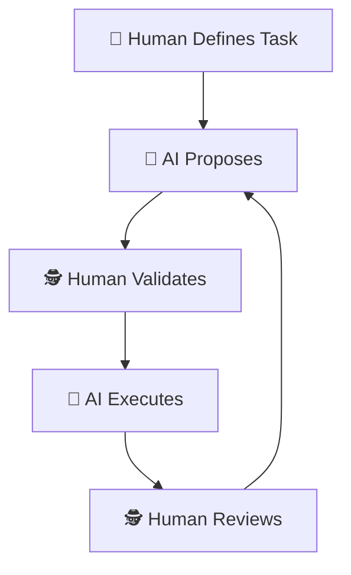

이 모드는 다음 상황에 필수적입니다:

- **새로운 도메인** 또는 패턴이 확립되지 않은 최초 구현
- **장기적 결과를 수반하며 되돌리기 어려운 아키텍처 결정**
- **프로덕션 데이터, 보안 민감 변경, 또는 컴플라이언스 요구사항이 관련된 고위험 작업**
- **이후의 자율적 작업 방향을 결정하는 기반 의사결정**

**OHOTL (Observed Human-on-the-Loop):** 인간이 실시간으로 지켜보는 가운데 시스템이 작동하며, 언제든지 개입할 수 있지만 각 단계마다 승인할 필요는 없습니다. 인간은 **동기적 인식과 비동기적 제어**를 유지합니다. 즉, 진행 상황을 실시간으로 파악하고 방향을 수정할 수 있지만, 승인을 기다리느라 진행이 차단되지는 않습니다.

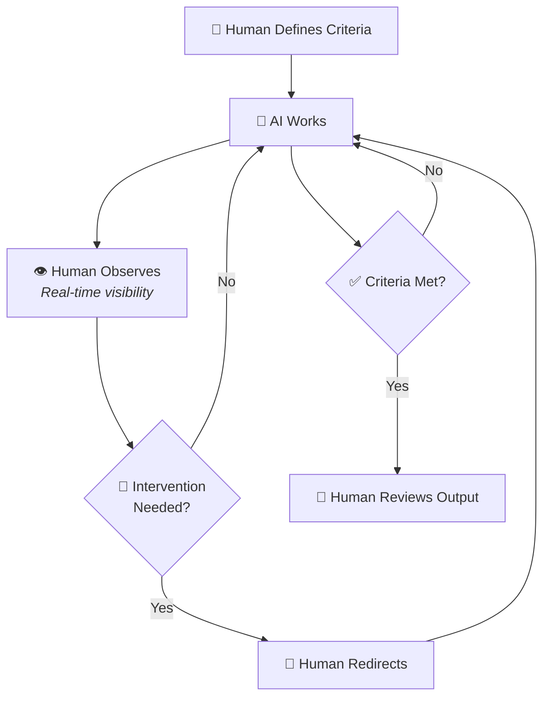

이 모드는 다음 상황에 적합합니다:

- **UX 결정, 디자인, 카피, 콘텐츠 등 창의적이고 주관적인 작업**
- **관찰 자체가 교육적 가치를 지니는 교육 및 온보딩 시나리오**
- **차단적 승인 없이도 인간의 인식이 도움이 되는 중간 위험도 변경**
- **공식적인 게이트 없이 실시간 인간 판단이 필요한 판단 집약적 작업**
- **인간의 감각이 방향을 이끄는 반복적 개선**

**AHOTL (Autonomous Human-on-the-Loop):** 시스템이 자율적으로 작동하는 동안 인간은 주기적으로 업데이트를 받고 필요할 때만 개입합니다. AI는 정의된 경계 내에서 성공 기준이 충족될 때까지 실행하며, 개입이 필요한 경우에만 인간에게 알립니다.

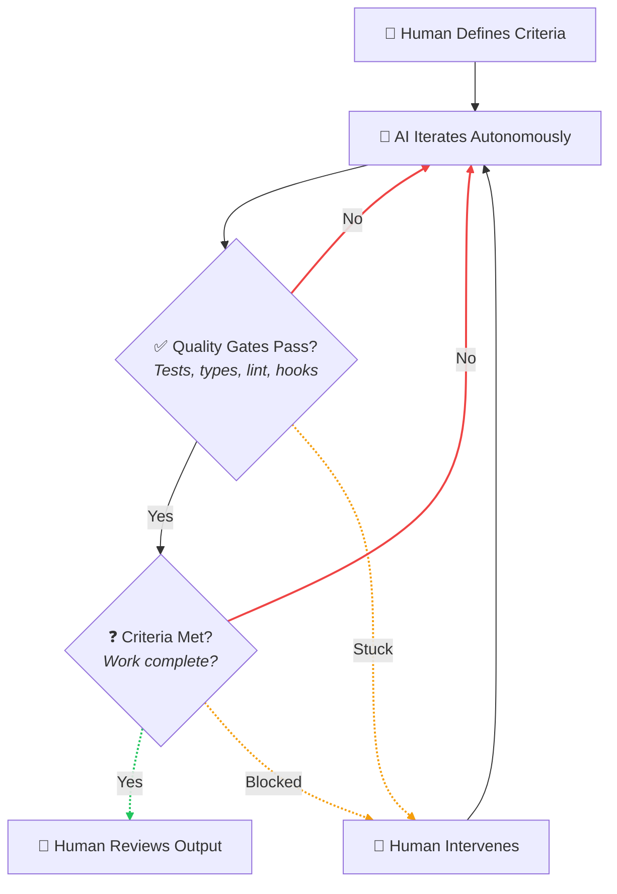

이 모드는 다음 상황에 적합합니다:

- **명확하고 측정 가능한 인수 기준이 있는 잘 정의된 작업**
- **테스트, 타입 검사, 린팅으로 정확성을 검증할 수 있는 프로그래밍적으로 검증 가능한 작업**
- **마이그레이션, 리팩터링, 테스트 커버리지 확장 등의 배치 작업**
- **야간 또는 업무 외 시간에 실행할 수 있는 백그라운드 작업**
- **확립된 패턴을 따르는 기계적 변환**

**세 가지 모드 비교:**

| 측면 | HITL | OHOTL | AHOTL |
|--------|------|-------|-------|
| **인간의 주의** | 지속적, 차단적 | 지속적, 비차단적 | 주기적, 필요 시 |
| **승인 모델** | 각 단계 이전 | 언제든지 (인터럽트) | 완료 시 |
| **AI 자율성** | 최소 | 중간 | 경계 내 완전 자율 |
| **피드백 루프** | 동기적 | 실시간, 선택적 | 비동기적 |
| **최적 용도** | 새롭고 고위험한 작업 | 창의적, 주관적 작업 | 기계적, 검증 가능한 작업 |

Google Maps 비유는 세 가지 모드 모두에 적용됩니다:

- **HITL:** 매 회전마다 GPS에 지시하면, GPS가 확인하고, 당신이 승인하면, GPS가 실행합니다
- **OHOTL:** GPS가 운전하는 동안 당신이 경로를 지켜보며, 언제든지 "아니, 그쪽 말고"라고 말할 수 있습니다
- **AHOTL:** 목적지를 설정하고 허용 경로를 정의한 뒤(유료 도로 제외, 고속도로 회피 등), 도착했을 때 확인합니다

**핵심 통찰:** 인간이 사라지는 것이 아니다. 인간의 *역할*이 바뀌는 것이다—실행을 세세하게 관리하는 것에서 결과를 정의하고, 진행 상황을 관찰하며, 품질 게이트를 구축하는 것으로. 어떤 모드를 선택할지는 작업의 위험 수준만이 아니라 작업의 성격에 따라 결정된다.

### 처방 대신 역압(Backpressure)

기존 방법론은 작업을 *어떻게* 수행해야 하는지를 처방한다. 세부적인 프로세스 단계, 코드 리뷰 체크리스트, 구현 패턴 등은 AI가 자신의 역량을 최대한 발휘하지 못하도록 제약하는 경직된 워크플로를 만들어낸다.

AI-DLC 2026은 다른 접근 방식을 도입한다: **역압(backpressure)**—접근 방식을 지시하지 않으면서 기준에 맞지 않는 작업을 거부하는 품질 게이트다.

> "방법을 처방하지 말라; 나쁜 작업을 거부하는 게이트를 만들어라."
> — Geoffrey Huntley

"먼저 인터페이스를 작성하고, 그다음 클래스를 구현하고, 그다음 단위 테스트를 작성하고, 그다음 통합 테스트를 작성하라"고 명시하는 대신, 반드시 충족해야 할 제약 조건을 정의하라:

- 모든 테스트가 통과해야 한다
- 타입 검사가 성공해야 한다
- 린팅이 깨끗해야 한다
- 보안 스캔을 통과해야 한다
- 커버리지가 임계값을 초과해야 한다
- 성능 벤치마크를 충족해야 한다

이 제약 조건을 *어떻게* 충족할지는 AI가 결정하게 하라. 이 접근 방식은 여러 이점을 제공한다:

- **AI 역량을 완전히 활용** — AI가 인위적인 제약 없이 학습과 추론을 적용할 수 있다
- **프롬프트 복잡성 감소** — 성공 기준은 단계별 지침보다 명시하기 쉽다
- **성공을 측정 가능하게** — 프로그래밍 방식의 검증이 자율적 운영을 가능하게 한다
- **반복을 가능하게** — 각 실패는 신호를 제공하고, 각 시도는 접근 방식을 개선한다

처방적 워크플로는 지능의 상한선을 만든다—마치 자문단에게 예/아니오 답변만 허용하는 것과 같다. 프론티어 모델은 수백만 건의 엔지니어링 결정에서 나온 패턴을 담고 있다. 역압은 이를 해방시킨다: 결과를 정의하면 AI는 아키텍처 대안을 제안하고, 제약 충돌을 발견하며, 미처 생각하지 못했던 경로를 찾기 위해 학습을 적용할 수 있다.

이 철학은 다음과 같이 요약할 수 있다: **"예측 불가능하게 성공하는 것보다 예측 가능하게 실패하는 것이 낫다."** 각 실패는 데이터다. 각 반복은 접근 방식을 개선한다. 핵심 역량은 AI를 단계별로 지시하는 것에서 올바른 해결책으로 수렴하는 기준과 테스트를 작성하는 것으로 이동한다.

#### 하네스가 강제하는 품질 게이트

위에서 설명한 역압은 하나의 원칙이다. AI-DLC 2026은 이를 **하네스가 강제하는 품질 게이트**로 구현한다: 하네스가 모든 Stop 이벤트에서 실행하는 구조화된 프론트매터 기반 검사다. 에이전트는 모든 게이트가 통과될 때까지 멈출 수 없다—진행할 수도, 인계할 수도, 작업 완료를 선언할 수도 없다.

게이트는 Intent와 각 Unit의 YAML 프론트매터에 선언된다:

```yaml
# intent.md frontmatter
quality_gates:
  - name: tests
    command: bun test
  - name: typecheck
    command: tsc --noEmit
  - name: lint
    command: biome check
```

**이 게이트를 강제하는 것은 에이전트가 아니라 하네스다.** 빌딩 에이전트가 멈추려 할 때, `quality-gate.sh` 훅이 실행되어 활성 Intent와 Unit의 프론트매터를 읽고, 각 게이트 명령을 실행하며, 게이트가 하나라도 실패하면 구조화된 블록 결정을 내보낸다. 에이전트는 실패 출력을 확인하고 진행하기 전에 문제를 수정해야 한다. 이는 AI에게 "테스트를 실행하라"고 요청하는 것과 질적으로 다르다—에이전트는 실패한 훅을 합리화로 우회할 수 없다.

**이를 견고하게 만드는 네 가지 속성:**

1. **정교화 중 자동 감지.** 디스커버리 스킬이 저장소 도구(`package.json`, `go.mod`, `pyproject.toml`, `Cargo.toml`, `bun.lock`)를 검사하고 정교화 시점에 적절한 게이트를 제안한다. 인간이 구성 시작 전에 이를 확인하거나 조정한다.

2. **래칫을 적용한 추가적 병합.** Intent 수준 게이트와 Unit 수준 게이트는 추가적으로 병합된다—Unit 게이트는 Intent 게이트에 추가되며, 절대 대체하지 않는다. 구성 중에는 게이트를 추가만 할 수 있다. reviewer hat은 리뷰의 일환으로 게이트 무결성을 검증한다: 게이트 제거가 발생하면 변경 요청 결정이 트리거된다. 이것이 래칫 효과다: 품질 기준은 앞으로만 나아갈 수 있다.

3. **범위가 지정된 강제.** 빌딩 hats(builder, implementer, refactorer)만 게이트 강제 대상이다. planner, reviewer, designer hats는 자동으로 강제를 건너뛴다—이들은 목표가 다르며, 리뷰 중 실패한 테스트로 인해 차단되어서는 안 된다.

4. **루프 방지.** 하네스는 중첩된 서브에이전트 시나리오에서 재진입 루프를 방지하기 위해 `stop_hook_active` 플래그를 제공한다. 이 가드는 의도적이다: 이미 한 번 차단된 서브에이전트는 두 번째 시도에서 멈출 수 있도록 허용되어 교착 상태를 방지한다.

이 메커니즘은 "지침으로서의 품질 게이트"와 "구조적 제약으로서의 품질 게이트" 사이의 간극을 해소한다. 게이트는 에이전트가 처리해야 할 체크리스트가 아니라, 하네스가 제어하는 종료 조건이다.

#### 시각적·디자인 역압

역압 원칙은 코드 품질을 넘어 **디자인 품질**로 확장된다. 테스트, 린터, 타입 검사가 기준에 맞지 않는 코드를 거부하듯, 시각적 충실도 게이트는 디자인 의도에서 벗어난 구현을 거부한다.

**활성화 휴리스틱.** 시각적 역압은 관련성이 있다는 신호가 감지될 때 자동으로 활성화된다: Unit의 discipline이 `frontend` 또는 `design`이거나, 스펙이 디자인 아티팩트를 참조하거나, 변경 집합이 UI 파일을 건드리는 경우다. 이를 통해 백엔드 전용 Unit에 불필요한 게이트가 부과되는 것을 방지한다.

**디자인 참조 해석.** 시각적 비교가 활성화되면, 시스템은 3단계 우선순위를 통해 참조 이미지를 해석한다:

1. **외부 디자인 도구** — Figma 내보내기, Sketch 에셋 또는 동등한 것 (최고 충실도)
2. **이전 반복** — 마지막으로 성공한 Bolt의 스크린샷 (연속성 검사)
3. **와이어프레임** — 정교화 아티팩트의 대략적인 레이아웃 (최소 기준)

참조가 없는 경우, 게이트는 차단하는 대신 경고를 기록한다—참조의 부재 자체가 표면화할 가치 있는 신호다.

**스크린샷 캡처.** 구현 스크린샷은 플러그인 가능한 인프라를 통해 캡처된다. Playwright 기반 캡처가 웹 인터페이스의 기본값이며, 팀은 수동 캡처, 네이티브 스크린샷 도구, 또는 기기별 하네스로 대체할 수 있다. 메커니즘은 원칙보다 부차적이다: Bolt는 비교를 위한 시각적 아티팩트를 생성해야 한다.

**비전 모델 비교.** AI 비전 모델은 캡처된 스크린샷을 확정된 참조 이미지와 비교하여 레이아웃 충실도, 색상 정확도, 컴포넌트 존재 여부, 반응형 동작을 평가합니다. 비교 결과는 pass, warn, fail 중 하나의 구조화된 판정으로 출력되며, 주석이 달린 차이점도 함께 제공됩니다. 실패 판정은 실패한 테스트와 동일한 방식으로 Bolt 루프에 피드백됩니다. 즉, 빌더가 비교 출력을 받아 반복 작업을 수행합니다.

이를 통해 백프레셔(backpressure)가 AI가 잘 처리하는 영역(테스트, 타입, 린트)에서 자율 에이전트가 역사적으로 어려움을 겪어온 영역인 **시각적 충실도**까지 확장됩니다. 이 게이트는 UI를 어떻게 구축할지 규정하지 않습니다. 합의된 디자인과 일치하지 않는 구현을 거부할 뿐입니다.

### 축소되는 SDLC 수용하기

전통적인 SDLC 단계는 반복이 비쌌기 때문에 존재했습니다. 분석가 → 아키텍트 → 개발자 → 테스터 → 운영으로 이어지는 각 인수인계 과정에서 컨텍스트가 손실되고, 지연이 발생하며, 불일치가 생길 여지가 만들어졌습니다. 승인 게이트를 갖춘 순차적 단계는 반복 비용이 높은 세계에서의 경제적 최적화였습니다.

AI 시대에는 이 경제적 계산이 역전됩니다. 반복은 거의 무료입니다. 인수인계로 인한 컨텍스트 손실이 지배적인 비용이 됩니다. AI-DLC 2026은 개발을 불연속적인 단계가 아닌, 전략적 체크포인트를 갖춘 **연속적 흐름**으로 모델링합니다.

#### ❌ 전통적인 순차 단계

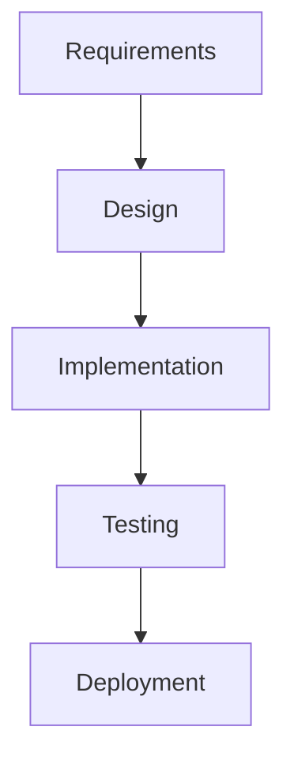

각 인수인계 지점에서 작업이 완전히 중단됩니다. 컨텍스트가 전문화된 역할 간에 이전됩니다. 새로운 담당자는 이해를 처음부터 다시 구축해야 합니다.

#### ✅ AI-DLC 2026 축소된 흐름

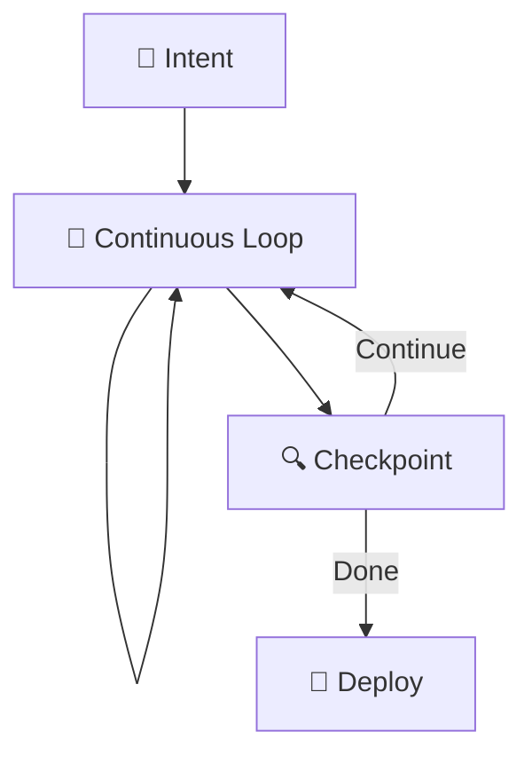

작업은 체크포인트에서 잠시 멈춥니다. 동일한 에이전트가 피드백을 받아 계속 진행합니다. 컨텍스트는 전 과정에 걸쳐 보존됩니다.

**체크포인트는 인수인계와 다릅니다:**

| 인수인계 (전통적) | 체크포인트 (AI-DLC 2026) |
|-----------------------|--------------------------|
| 작업이 완전히 중단됨 | 작업이 잠시 일시 중지됨 |
| 컨텍스트가 다른 담당자에게 이전됨 | 동일한 에이전트가 피드백을 받아 계속 진행 |
| 새로운 담당자가 이해를 다시 구축해야 함 | 컨텍스트가 보존됨 |
| 문서가 지식을 전달함 | 파일과 git이 지식을 전달함 |
| 진행을 위해 승인이 필요함 | 리뷰를 통해 필요한 조정 사항을 파악함 |

이것이 구조가 사라진다는 의미는 아닙니다. 구조의 형태가 바뀐다는 의미입니다. 순차적 게이트에서 전략적 순간에 인간의 감독이 이루어지는 병렬 루프로 변화합니다.

### Pass를 통한 반복

단계들이 연속적 흐름으로 축소되더라도, 실제 제품 개발에는 여전히 디자인, 제품, 엔지니어링이라는 서로 다른 전문성을 동일한 Intent에 가져오는 뚜렷한 분야들이 존재합니다. 핵심 질문은 이러한 분야들이 순차적으로 기여하느냐(종종 그렇습니다)가 아니라, 그 순서가 경직되고 손실이 많은지(워터폴) 아니면 유연하고 반복적인지의 여부입니다.

AI-DLC 2026은 **Passes**를 도입합니다. 이는 표준 AI-DLC 루프(정교화 → units → 실행 → 리뷰)를 통한 타입이 지정된 반복으로, 각 pass는 서로 다른 분야적 관점을 통해 Intent를 정제합니다. 한 pass의 출력이 다음 pass의 입력이 됩니다.

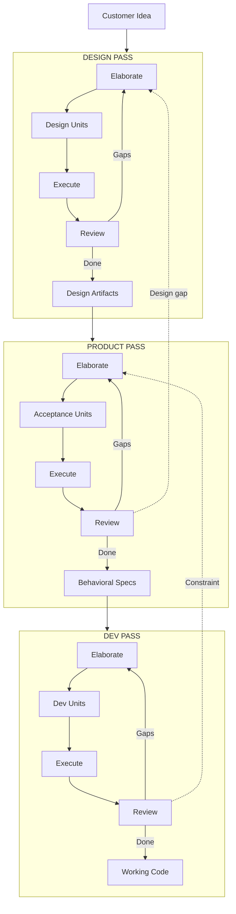

**워터폴과의 핵심 차이점:** 역방향 화살표는 예외적인 것이 아니라 예상된 것입니다. 개발 pass에서 디자인 가정을 무효화하는 제약 조건을 발견하면, 작업은 제품 pass 또는 디자인 pass로 되돌아갑니다. 이것은 실패가 아닙니다. Intent가 bolt보다 더 높은 수준에서 반복되는 것입니다.

**각 pass는 동일한 AI-DLC 루프를 사용하지만** 참여자, 입력, 출력이 다릅니다:

| | Design Pass | Product Pass | Dev Pass |
|---|---|---|---|
| **정교화 담당** | 디자인 + 제품 | 제품 (디자인 검토) | 제품 + 디자인 + 개발 |
| **Unit 유형** | 디자인 units | 인수 units | 개발 units |
| **실행 모드** | OHOTL (주관적) | HITL (판단) | AHOTL 또는 HITL |
| **출력 산출물** | 고충실도 디자인 | 행동 명세 + 기준 | 작동하는 코드 |
| **피드백 흐름 대상** | 자기 자신 | 갭 발견 시 디자인으로 역행 | 제약 발견 시 제품으로 역행 |

**Passes는 선택적이며 구성 가능합니다.** CLI 도구를 만드는 솔로 개발자는 개발 pass만 필요할 수 있습니다. 소비자 제품을 만드는 크로스 기능 팀은 세 가지 모두를 사용할 수 있습니다. 이 방법론은 어떤 Passes를 사용할지 규정하지 않습니다. 필요한 팀을 위한 구조를 제공할 뿐입니다.

**Passes는 "모두가 빌더가 된다" 원칙을 보존합니다.** 디자인 pass를 실행하는 디자이너는 개발 pass를 실행하는 엔지니어와 동일한 정교화 → 실행 → 리뷰 루프를 사용합니다. 워크플로우는 동일하며, 분야와 산출물만 다릅니다.

#### Pass 정의 파일

각 pass는 프론트매터가 활성화된 마크다운 파일로 정의됩니다. 프론트매터는 pass의 정체성과 제약 조건을 선언합니다:

- `name` — Pass 식별자 (예: `design`, `product`, `dev`)
- `description` — 이 pass가 생성하는 것
- `available_workflows` — 이 pass 중에 사용할 수 있는 명명된 워크플로우
- `default_workflow` — 요청된 워크플로우를 사용할 수 없을 때의 폴백

마크다운 본문에는 구성 중에 빌더 및 리뷰어 hat 컨텍스트에 주입되는 지침이 포함되어 있으며, 별도의 에이전트 구성 없이 에이전트를 해당 pass의 분야 방향으로 안내합니다.

**내장 Pass와 워크플로우 제약:**

| Pass | 사용 가능한 워크플로우 | 기본값 | 초점 |
|------|-------------------|---------|-------|
| **design** | `design` | `design` | 시각 및 인터랙션 디자인 — 목업, 프로토타입, 디자인 토큰 |
| **product** | `default`, `bdd` | `default` | 행동 명세 — 인수 기준, 엣지 케이스, 사용자 여정 |
| **dev** | `default`, `tdd`, `adversarial`, `bdd` | `default` | 실동작 구현 — 테스트 완료된 배포 가능한 코드 |

워크플로우 제약은 불일치를 방지합니다. design pass 중에 `tdd`를 요청하면 자동으로 해당 design pass의 `default_workflow`로 폴백됩니다. 이를 통해 적절한 시점에 올바른 방법론이 적용됩니다.

#### Pass 루프

실행은 Intent의 `passes` 배열을 통해 한 번에 하나의 Pass씩 진행됩니다:

1. 활성 Pass의 분야별 Unit 상세화
2. 표준 Bolt 사이클을 통해 해당 Unit 실행
3. 활성 Pass의 Unit이 완료되면 `active_pass`를 다음 항목으로 진행
4. 새로운 Pass에 대해 1단계부터 반복

모든 Pass가 완료되면 Intent는 통합 및 배포 준비가 됩니다.

#### Pass-Back

이후 Pass에서 이전 Pass 작업이 필요한 문제가 발견되면 Intent는 역방향으로 반복됩니다:

1. `active_pass`가 대상 Pass로 역방향 설정됨 (예: dev → product, product → design)
2. 재상세화 발생 — 기존 완료된 Unit과 함께 새로운 Unit이 생성됨
3. Pass-back이 해결된 후 순방향 진행 재개

Pass-back은 리뷰어 권고 또는 사용자 결정에 의해 트리거됩니다. 이는 정상적인 교차 분야 반복을 나타냅니다. 예를 들어 dev Pass에서 디자인 가정을 무효화하는 제약이 발견되면 해당 작업이 수정을 위해 design Pass로 되돌아갑니다.

#### 단일 Pass 기본값

`passes`가 구성되지 않았거나 (`passes: []`이고 `active_pass`가 비어 있는) Intent는 암묵적인 단일 dev Pass를 사용합니다. 다중 Pass 반복이 필요하기 전까지 Pass 시스템은 오버헤드를 전혀 추가하지 않습니다. 프로젝트는 `.ai-dlc/settings.yml`의 `default_passes`를 통해 기본 Pass 구조를 설정합니다.

#### Pass 커스터마이징

Pass 시스템은 hats와 공유되는 증강 패턴을 사용합니다:

- **내장 Pass 증강:** 내장 Pass와 `{name}`이 일치하는 `.ai-dlc/passes/{name}.md`를 생성합니다. 프로젝트 파일의 지침은 "Project Augmentation" 제목 아래에 추가됩니다 — 내장 지침은 대체되지 않고 보존됩니다.
- **커스텀 Pass 정의:** 내장 Pass와 일치하지 않는 이름으로 `.ai-dlc/passes/{name}.md`를 생성합니다. 커스텀 Pass의 지침이 직접 사용됩니다.
- **기본값 구성:** `.ai-dlc/settings.yml`의 `default_passes`를 설정하여 새 Intent가 기본적으로 받는 Pass를 제어합니다.

동일한 증강 패턴이 hats에도 적용됩니다. 플러그인이 제공하는 hats가 기준이 되며, `.ai-dlc/hats/`의 프로젝트 수준 파일은 이를 대체하는 것이 아니라 증강합니다.

### 컨텍스트는 풍부합니다 — 현명하게 활용하세요

현대 언어 모델은 200K 토큰(Claude Opus 4.5)에서 100만 토큰 이상(Claude Sonnet 4.5, Gemini)에 이르는 컨텍스트 윈도우를 제공합니다. 이러한 풍부함은 AI 워크플로우에 대한 사고방식을 근본적으로 바꾸지만, 그 방향이 직관적이지 않을 수 있습니다.

**19-에이전트 함정:** AI에 대한 초기 열기는 AI 에이전트를 전통적인 조직도에 매핑하는 복잡한 다중 에이전트 스캐폴딩으로 이어졌습니다 — 분석가 에이전트, PM 에이전트, 아키텍트 에이전트, 개발자 에이전트, QA 에이전트 등. 이 접근 방식은 다음과 같은 이유로 더 단순한 대안보다 일관되게 **성능이 낮습니다**:

- 대형 윈도우에도 불구하고 에이전트 간 핸드오프마다 컨텍스트가 손실됨
- 스캐폴딩이 많을수록 정렬 불일치 가능성이 높아짐
- 오케스트레이션 오버헤드가 주의 예산을 소모함
- 다중 에이전트 장애 디버깅이 기하급수적으로 어려워짐

> "에이전트가 도구를 축적할수록 더 멍청해진다."

연구에 따르면 컨텍스트 윈도우 활용률이 40~60%를 초과하면 모델 성능이 저하됩니다 — 이른바 "둔화 구간"입니다. 대형 컨텍스트의 "중간에 묻힌" 정보는 처음이나 끝에 있는 정보보다 주의를 덜 받습니다.

**핵심 인사이트:** 풍부한 컨텍스트 윈도우는 모든 것을 채워 넣어야 한다는 의미가 아닙니다. 압축된 요약 대신 **고품질 컨텍스트를 선별적으로** 활용할 수 있다는 의미입니다. AI-DLC 2026은 다음을 선호합니다:

- 산발적인 정보를 가진 포괄적 에이전트보다 관련 컨텍스트를 가진 **소규모의 집중된 에이전트**
- 컨텍스트 선택에서 **양보다 질**
- 컨텍스트 채우기보다 **전략적 컨텍스트 엔지니어링**
- 복잡한 오케스트레이션보다 명확한 목표를 가진 **단순한 루프**

최고의 워크플로우는 복잡한 오케스트레이션이 아닙니다 — 명확한 목표와 풍부하고 관련성 높은 컨텍스트를 가진 단순한 루프입니다.

#### 운영 컨텍스트 경제

"둔화 구간"에 대한 이론적 경고는 실행 중 컨텍스트 예산을 관리하기 위한 실용적인 기법을 필요로 합니다. 관리하지 않으면 컨텍스트는 오래된 지침, 중복 참조, 그리고 에이전트가 작업 중간에 실제로 필요로 하는 정보를 밀어내는 초기 로드 자료로 가득 차게 됩니다.

**컨텍스트 예산 모니터링.** 자동화된 경고가 설정 가능한 활용률 임계값(예: 60%, 80%)에서 발동되어 성능이 저하되기 전에 하네스 또는 사람이 수정 조치를 취할 수 있습니다. 컨텍스트 한계에 근접한 Bolt는 밀어붙일 것이 아니라 정리, 요약, 또는 작업 분할의 신호입니다.

**참조 동반 파일.** 스타일 가이드, API 스키마, 코딩 컨벤션 등 프롬프트 토큰을 소모할 정적 참조 자료는 디스크의 동반 파일로 추출할 수 있습니다. 에이전트는 매번 프롬프트에 담는 대신 필요할 때 읽습니다. 이를 통해 지속적인 컨텍스트 오버헤드가 온디맨드 파일 읽기로 전환되어 동적 추론을 위한 예산이 확보됩니다.

**지연 주입.** 이전 Bolt의 학습 내용, 디자인 참조, 도메인 컨텍스트는 Bolt 시작 시 미리 로드하는 것이 아니라 현재 hat의 작업과 관련성이 생길 때만 로드됩니다. 데이터베이스 마이그레이션을 작업하는 builder hat은 다음 Unit의 designer hat이 필요로 할 디자인 시스템 토큰이 필요하지 않습니다. 사용 시점까지 주입을 미루면 활성 컨텍스트가 간결하게 유지됩니다.

**역할 범위 컨텍스트.** hat 기반 워크플로우에서 각 hat은 자신의 역할과 관련된 컨텍스트만 받습니다. reviewer hat은 전체 상세화 이력이 아닌 diff와 완료 기준을 받습니다. test-writer hat은 구현 계획이 아닌 명세와 기존 테스트 패턴을 받습니다. 활성 역할에 맞게 컨텍스트를 범위 지정하면 "도구가 많을수록 에이전트가 멍청해진다"는 현상을 직접적으로 억제할 수 있습니다.

이러한 기법들은 앞서 언급한 원칙을 실천에 옮긴 것입니다. 풍부한 컨텍스트는 잘 선별되었을 때만 자산이 됩니다. 컨텍스트 윈도우를 무분별하게 채우면 컨텍스트가 너무 적을 때와 동일한 품질 저하가 발생합니다. 신호가 노이즈에 묻혀버리는 것입니다.

### 메모리 프로바이더가 지식을 확장한다

AI 컨텍스트 윈도우는 세션 간에 초기화됩니다. 수정된 파일과 git 히스토리는 복잡한 메모리 인프라 없이도 지속성을 제공합니다. AI-DLC 2026은 이 통찰을 확장하여 **기존 조직의 산출물이 AI 에이전트가 접근할 수 있는 메모리 프로바이더**임을 인식합니다.

전통적인 SDLC 프로세스는 방대한 문서를 생성했지만, 그 대부분은 활용되지 못했습니다:

- 제품 요구사항 문서(PRD)
- 아키텍처 결정 기록(ADR)
- 기술 설계 명세서
- 런북 및 운영 절차서
- 티켓 및 이슈 히스토리
- 회고록 및 사후 분석 보고서

이러한 산출물들은 조직의 기억을 나타냅니다. 즉, 내려진 결정들, 문서화된 근거들, 확립된 패턴들입니다. 현대적인 통합 프로토콜(MCP 서버, API 커넥터, 지식 베이스)을 통해 AI 에이전트는 이제 이 메모리에 직접 접근할 수 있습니다.

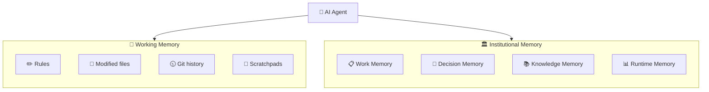

**AI-DLC 2026의 메모리 레이어:**

| 레이어 | 위치 | 속도 | 목적 |
|-------|----------|-------|---------|
| **Rules** | 프로젝트 규칙 파일 | 즉시 | 컨벤션, 패턴, 제약 조건 |
| **세션** | 작업 파일, 스크래치패드 | 빠름 | 현재 작업 컨텍스트, 진행 상황 |
| **프로젝트** | Git 히스토리, 코드베이스 | 인덱싱됨 | 시도한 것, 효과가 있었던 것 |
| **조직** | 연결된 시스템 | 쿼리 | 조직 지식, 결정 사항 |
| **런타임** | 모니터링 시스템 | 쿼리 | 프로덕션 동작, 인시던트 |

**실질적인 시사점:**

- 기능을 구현하는 에이전트는 티켓 시스템에서 인수 기준을 조회할 수 있습니다
- 아키텍처 결정을 내리는 에이전트는 선례를 위해 관련 ADR을 검색할 수 있습니다
- 디버깅하는 에이전트는 유사한 증상에 대한 인시던트 히스토리에 접근할 수 있습니다
- 문서를 작성하는 에이전트는 스타일에 대한 기존 표준을 조회할 수 있습니다

파일시스템은 가장 단순하고 견고한 메모리 프로바이더로 남아 있습니다. Git 히스토리는 무엇이 시도되었는지를 보여줍니다. 수정된 파일은 반복 작업 전반에 걸쳐 지속됩니다. 그러나 이것이 유일한 선택지는 아닙니다. 조직의 메모리가 적절히 연결되면 에이전트가 알 수 있는 것의 범위가 극적으로 확장됩니다.

### 완료 기준이 자율성을 가능하게 한다

자율적 운영의 핵심 요소는 **프로그래밍 방식의 검증**입니다. 성공을 기계가 측정할 수 있다면, AI는 각 단계마다 인간의 개입 없이 그것을 향해 반복할 수 있습니다.

AI-DLC 2026의 모든 작업 요소에는 성공을 정의하는 프로그래밍 방식으로 검증 가능한 조건인 명시적인 **완료 기준(Completion Criteria)**이 있어야 합니다:

**좋은 완료 기준의 특징:**

- **구체적이고 측정 가능함** — "코드가 좋다"가 아니라 "TypeScript가 strict 모드로 컴파일된다"
- **프로그래밍 방식으로 검증 가능함** — 테스트 통과, 린터 성공, 벤치마크 충족
- **구현 독립적** — 어떻게가 아닌 무엇을 정의함
- **완전함** — 기능 요구사항, 품질 속성, 제약 조건을 모두 포함함

**예시:**

| 나쁜 기준 | 좋은 기준 |
|--------------|---------------|
| "코드가 잘 테스트되어 있다" | "모든 테스트가 80% 이상의 커버리지로 통과한다" |
| "API가 성능이 좋다" | "API가 1000 req/s 부하에서 p95 기준 200ms 미만으로 응답한다" |
| "코드가 타입 안전하다" | "TypeScript가 strict 모드로 오류 없이 컴파일된다" |
| "기능이 완성되었다" | "`tests/feature/`의 모든 인수 테스트가 통과한다" |
| "보안이 처리되었다" | "보안 스캔이 심각/높음 수준의 발견 사항 없이 통과한다" |

이는 인간의 역할을 "각 단계의 검증자"에서 "완료의 정의자"로 전환합니다. 인간은 성공이 어떤 모습인지를 명시하고, AI는 그것을 달성하는 방법을 찾아냅니다.

### 디자인 기법은 도구이지 요구사항이 아니다

AI-DLC 2026은 실용적인 접근 방식을 취한다. 도메인 주도 설계(DDD), 테스트 주도 개발(TDD), 행동 주도 개발(BDD)과 같은 디자인 기법은 적절한 상황에서 활용하는 유용한 도구이지, 모든 워크플로우에서 반드시 거쳐야 하는 단계가 아니다.

**구조적 설계(DDD, TDD, BDD)를 활용해야 할 때:**

- 도메인 복잡성이 명시적 모델링을 통해 이점을 얻을 수 있을 때
- 여러 팀이 경계에 대한 공통된 이해를 필요로 할 때
- 장기적인 유지보수성이 최우선일 때
- 컴플라이언스 요구사항이 문서화를 요구할 때

**사전에 무거운 설계 작업을 생략해도 될 때:**

- 작업이 명확하게 정의되고 범위가 한정되어 있을 때
- 분석보다 빠른 반복이 올바른 구조를 더 빨리 드러낼 때
- 자동화된 검증으로 정확성을 확인할 수 있을 때
- 코드베이스에 이미 디자인 패턴이 확립되어 있을 때

AI는 별도의 명시적인 설계 단계 없이도 실행 중에 디자인 패턴을 적용할 수 있다. AI가 코드를 생성할 때, 팩토리 메서드, 의존성 주입, 리포지토리 패턴 등 적절한 패턴을 별도의 지시 없이도 훈련 데이터를 바탕으로 스스로 적용한다.

**아키텍처 문서가 아닌 테스트 스위트가 진실의 원천이 된다.** 테스트를 통과하고 비기능적 요구사항을 충족한다면, 사전에 명세된 설계와 일치하는지 여부와 관계없이 해당 구현은 유효하다.

### 모두가 빌더가 된다

전통적인 개발에서 "설계"와 "구현"은 서로 다른 전문가를 필요로 하는 별개의 단계였다.

- 디자이너가 목업을 만든다 (Figma, 와이어프레임)
- 개발자가 명세를 구현한다
- 인계는 문서나 이미지로 이루어지며, 종종 마찰의 원인이 된다

**AI는 이 간극을 없앤다.** AI가 React 컴포넌트를 생성할 때, 설계와 구현이 동시에 이루어진다. 목업에서 코드로의 인계 과정이 없다. 결과물 자체가 곧 설계다.

**이것이 디자이너를 없애는 것이 아니라, 모두가 직접 만들 수 있도록 역량을 부여한다.**

| 전통적 방식 | AI-DLC 2026 |
|-------------|-------------|
| 디자이너가 목업을 만들고 개발자를 기다린다 | 디자이너가 AI를 지시하고 즉시 결과를 확인한다 |
| 개발자가 명세를 해석하다 오해가 생길 수 있다 | 개발자가 기술적 정밀도로 AI를 지시한다 |
| 인계 과정에서 맥락이 손실된다 | 인계 없음—같은 사람이 완성될 때까지 다듬는다 |

**당신의 전문 분야가 곧 당신의 강점이다.** 모두가 동일한 워크플로우(빌더 → 리뷰어)를 사용하지만, 각자의 전문성은 AI를 더 잘 이끌 수 있는 맥락을 제공한다.

- **빌더로서의 디자이너:** 시각적 직관, UX 감각, 미적 판단력이 AI를 아름답고 사용하기 쉬운 인터페이스로 이끈다. 디자이너는 이제 개발자를 기다릴 필요 없이 자신의 비전을 직접 구현할 수 있다.
- **빌더로서의 백엔드 엔지니어:** 시스템 설계 지식, 성능 직관, 아키텍처 패턴이 AI를 견고하고 확장 가능한 서비스로 이끈다.
- **빌더로서의 프로덕트 매니저:** 사용자 공감 능력, 비즈니스 맥락, 우선순위 결정 능력이 AI를 실질적으로 중요한 기능으로 이끈다.
- **빌더로서의 테크니컬 라이터:** 명확한 커뮤니케이션, 독자 인식, 정보 구조화 능력이 AI를 사람들이 실제로 읽는 문서로 이끈다.

**핵심 역량은 실행에서 다듬기로 이동한다.** 모든 픽셀이나 코드 한 줄을 직접 구현하는 대신, AI가 생성한 결과물을 검토하고 자신의 비전에 맞게 방향을 잡아준다. 해당 분야에서 쌓아온 수년간의 경험이 무엇이 좋고, 무엇이 어긋났으며, 어떻게 개선해야 하는지를 더 잘 알아볼 수 있게 해준다.

이것은 민주화이지 제거가 아니다. 이전에는 목업만 만들 수 있었던 디자이너가 이제 동작하는 코드를 직접 배포할 수 있다. 프론트엔드를 피하던 백엔드 엔지니어가 이제 전체 기능을 구현할 수 있다. 모두가 역량을 얻고, 아무도 자신의 가치를 잃지 않는다. **당신의 전문성은 당신을 AI의 피해자가 아닌, 더 뛰어난 AI 디렉터로 만든다.**

**오퍼레이터 승수 효과.** AI는 평준화 도구가 아닌 역량 증폭기다. AI를 활용하는 주니어는 더 많은 작업을 해낼 수 있고, AI를 활용하는 숙련된 오퍼레이터는 더 뛰어난 시스템을 만들어낸다. 그 차이는 방향 설정에 있다. 아키텍처 부채가 쌓이기 전에 인식하고, 테스트가 커버하지 못하는 엣지 케이스를 잡아내며, AI의 제안이 국소 최적해에 불과한 시점을 파악하는 능력이다. 고품질 결과물은 여전히 숙련된 판단력을 필요로 한다. 직접적으로든, 아니면 경험 많은 빌더가 전체 방향을 이끄는 Mob Execution 패턴을 통해서든 마찬가지다.

### 책임의 간소화

AI가 작업 분해, 코드 생성, 테스트, 문서화, 배포를 수행할 수 있게 됨에 따라 전문화된 역할의 필요성이 줄어들었습니다. AI를 감독하는 단 한 명의 개발자가 이전에는 프론트엔드, 백엔드, 인프라, 테스트, 문서화 전문가들이 각각 따로 담당해야 했던 일을 해낼 수 있습니다.

이것이 인간의 가치를 없애는 것은 아닙니다—오히려 인간의 판단이 필수적인 활동에 **집중시킵니다**:

- **전략적 방향 설정** — 무엇을 왜 만들지 결정하기
- **트레이드오프 결정** — 비즈니스 맥락이 필요한 상충 관계 조율하기
- **검증** — 작업 결과가 실제 요구사항과 일치하는지 확인하기
- **리스크 평가** — 잠재적 위험을 식별하고 완화하기
- **품질 감독** — 자동화된 검사로는 포착할 수 없는 기준 유지하기

역할은 "직접 작업을 수행하는 것"에서 **"어떤 작업이 중요한지 정의하고 잘 완료되었는지 검증하는 것"** 으로 전환됩니다.

그러나 인간은 여전히 핵심적인 역할을 담당합니다. 제품 책임자는 비즈니스 목표와의 정합성을 보장하고, 개발자는 설계 품질을 유지하며 판단이 필요한 결정을 처리합니다. 이러한 역할들은 자동화와 인간의 책임이 균형을 이루도록 합니다.

### 도구 및 플랫폼 독립성

AI-DLC 2026은 의도적으로 도구와 인프라 모두에 대해 중립적인 입장을 취합니다. 이 방법론은 어떤 IDE, AI 에이전트, 클라우드 제공업체를 선택하든 관계없이 적용됩니다.

**도구보다 기법.** AI-DLC의 핵심은 특정 제품이 아닙니다—세션 간에 상태가 어떻게 유지되는지, 역압(backpressure)이 어떻게 반복을 이끄는지, 그리고 인간의 조종이 자율 실행과 어떻게 통합되는지에 관한 논리입니다. 이러한 패턴은 Claude Code, Cursor, Kiro, OpenCode, 또는 커스텀 에이전트 프레임워크 중 무엇을 사용하든 동작합니다. 원칙은 그대로 적용되며, 구현 세부 사항만 달라집니다.

**인프라 독립성.** 이 방법론은 배포 방식에 관계없이 적용됩니다:

- **컨테이너 오케스트레이션:** Kubernetes, ECS, Docker Swarm, Nomad
- **서버리스:** Lambda, Cloud Functions, Azure Functions, Cloudflare Workers
- **전통적 방식:** 가상 머신, 베어 메탈 서버
- **엣지:** IoT 디바이스, 엣지 컴퓨팅 플랫폼
- **하이브리드:** 위의 조합 중 어떤 것이든

도구와 인프라는 방법론의 제약이 아닌, 요구사항·비용 제약·팀의 전문성을 기준으로 선택하십시오.

---

## 핵심 프레임워크

이 섹션에서는 AI-DLC 2026의 핵심 프레임워크를 설명하며, 아티팩트, 단계, 의식(rituals), 워크플로를 상세히 다룹니다.

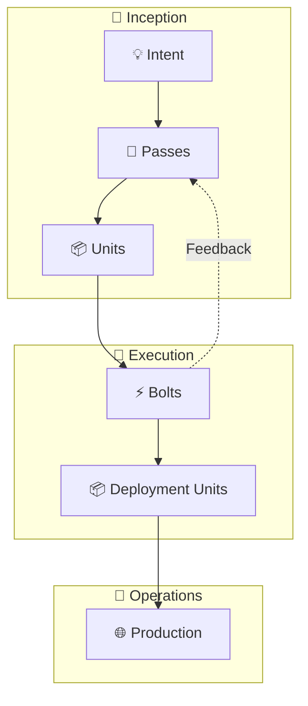

### 아티팩트

#### Intent

**Intent**는 비즈니스 목표, 기능, 또는 기술적 결과(예: 성능 확장, 보안 개선)를 막론하고 달성해야 할 것을 담은 고수준의 목적 선언문입니다. AI 기반 분해를 통해 실행 가능한 작업으로 나누는 출발점이 되며, 인간의 목표와 AI가 생성한 계획을 일치시킵니다.

모든 Intent에는 명시적인 **완료 기준(Completion Criteria)**이 포함됩니다—성공을 정의하고 자율 실행을 가능하게 하는 프로그래밍적으로 검증 가능한 조건들입니다.

**Intent 예시:**

```markdown
## Intent: User Authentication System

### Description
Add secure user authentication to the application supporting
email/password registration and OAuth providers for social login.

### Business Context
- Current system has no user accounts
- Need to support personalization features planned for Q2
- Must integrate with existing customer database

### Completion Criteria
- [ ] Users can register with email/password
- [ ] Users can log in and receive JWT tokens
- [ ] JWT tokens expire appropriately and can be refreshed
- [ ] OAuth flow works for Google and GitHub
- [ ] Password reset flow via email works
- [ ] All auth endpoints have >80% test coverage
- [ ] Security scan passes with no critical findings
- [ ] Load test: 100 concurrent logins complete in <2s p99
```

#### Pass

**Pass**는 특정 전문 분야의 관점을 통해 Intent를 정제하는, 표준 AI-DLC 루프(구체화, Unit으로 분해, 실행, 검토)를 거치는 유형화된 반복 작업입니다. Pass는 교차 기능 팀이 폭포수 방식의 인계 없이 공유된 Intent에 기여할 수 있게 하는 메커니즘입니다.

**각 Pass는 동일한 구조를 따릅니다:**

1. **구체화(Elaborate)** — 해당 Pass의 전문 분야 관점에서 범위를 명확히 하기
2. **분해(Decompose)** — 해당 분야에 적합한 Unit으로 나누기
3. **실행(Execute)** — 적절한 운영 모드를 사용하여 아티팩트 구축하기
4. **검토(Review)** — 결과물 검증; 미흡한 부분을 현재 또는 이전 Pass로 피드백하기

**기본 제공 Pass 유형:**

| Pass 유형 | 목적 | 일반적인 결과물 |
|-----------|---------|----------------|
| **design** | 시각 및 인터랙션 디자인 | 고충실도 목업, 프로토타입, 디자인 토큰 |
| **product** | 행동 명세 및 갭 분석 | 인수 기준, 엣지 케이스, 사용자 여정 |
| **dev** | 동작하는 구현체 | 테스트 완료된 배포 가능한 코드 |

**Intent 프론트매터의 Pass 설정:**

```yaml
# intent.md frontmatter
passes: [design, product, dev]
active_pass: "design"
```

`passes` 필드는 전문 분야 관점의 순서를 나열합니다. `active_pass` 필드는 현재 실행 중인 Pass를 추적합니다. Pass 완료 여부는 `active_pass`의 진행과 Unit 상태로 추론되며—Pass별 상태 필드는 별도로 존재하지 않습니다.

**Pass 정의 파일:** 각 Pass는 플러그인의 `passes/` 디렉터리에 프론트매터가 적용된 마크다운 파일로 정의됩니다. 프론트매터는 메타데이터(`name`, `description`, `available_workflows`, `default_workflow`)를 선언합니다. 마크다운 본문에는 구축 과정에서 builder 및 reviewer hat 컨텍스트에 주입되는 지침이 포함되어 있으며, 별도의 에이전트 설정 없이도 에이전트가 해당 Pass의 전문 분야에 집중하도록 유도합니다.

**워크플로 제약:** 각 Pass는 실행 중에 사용 가능한 명명된 워크플로를 선언합니다. design Pass는 `design` 워크플로만 허용합니다. product Pass는 `default`와 `bdd`를 허용합니다. dev Pass는 `default`, `tdd`, `adversarial`, `bdd`를 허용합니다. 요청된 워크플로가 현재 활성 Pass의 `available_workflows`에 없을 경우, 해당 Pass의 `default_workflow`가 대신 사용됩니다. 이를 통해 design Pass 중에 TDD를 실행하는 것과 같은 불일치를 방지합니다.

**Pass는 선택 사항이며 기본적으로 오버헤드가 없습니다.** `passes`가 구성되지 않았거나 `passes: []`에 `active_pass`가 비어 있는 Intent는 단일 암묵적 dev pass를 사용합니다. pass 시스템은 다중 패스 반복이 필요할 때까지 보이지 않습니다. 프로젝트는 `.ai-dlc/settings.yml`의 `default_passes`를 통해 기본 pass 구조를 구성합니다.

**Pass 루프:** 실행은 한 번에 하나의 pass씩 진행됩니다. 활성 pass의 Unit이 완료되면 `active_pass`가 배열의 다음 pass로 진행되고, 해당 pass의 분야별 Unit에 대한 새로운 정교화 사이클이 시작됩니다. 루프는 다음과 같습니다: 정교화 → 실행 → (pass 진행) → 정교화 → 실행 → ... → 모든 pass 완료.

**Pass-back:** 이후 pass에서 이전 pass 작업이 필요한 문제가 발견되면 `active_pass`가 대상 pass로 되돌아갑니다. 재정교화가 수행되고(기존 완료된 Unit과 함께 새 Unit이 생성됨), pass-back이 해결된 후 순방향 진행이 재개됩니다. Pass-back은 검토자 권고 또는 사용자 결정에 의해 트리거되며, 이는 실패가 아닌 정상적인 교차 분야 반복을 나타냅니다.

**Pass 커스터마이징:** 프로젝트는 `.ai-dlc/passes/{name}.md`를 생성하여 내장 pass를 보강할 수 있습니다. 프로젝트 파일의 지침은 기존 내용을 대체하지 않고 "Project Augmentation" 제목 아래에 추가됩니다. 또한 내장 pass와 일치하지 않는 이름으로 pass 파일을 생성하여 완전히 커스텀 pass를 정의할 수도 있습니다. 이와 동일한 보강 패턴이 hats에도 적용됩니다. 플러그인이 제공하는 hats가 기본이며, `.ai-dlc/hats/`의 프로젝트 수준 hats가 이를 보강합니다.

**Pass 아티팩트는 컨텍스트로 유지됩니다:** 완료된 각 pass는 아티팩트(설계, 명세, 코드)를 생성하며, 이는 다음 pass의 입력 컨텍스트가 됩니다. 이를 통해 전통적인 인계 과정에서 손실되는 조직적 지식이 보존됩니다.

#### Unit

**Unit**은 Intent에서 도출된 응집력 있고 독립적인 작업 요소로, 측정 가능한 가치를 제공하도록 특별히 설계되었습니다. Unit은 도메인 주도 설계의 Bounded Context 또는 스크럼의 Epic과 유사합니다.

**잘 정의된 Unit의 특성:**

- **응집성:** Unit 내의 사용자 스토리가 높은 연관성을 가짐
- **느슨한 결합:** 다른 Unit에 대한 의존성 최소화
- **독립적 배포 가능:** 다른 Unit 없이도 프로덕션에 배포 가능
- **명확한 경계:** 소유권과 범위가 명확함
- **명시적 의존성:** 상위 Unit이 프론트매터에 선언됨
- **단일 분야:** 각 Unit은 하나의 분야(프론트엔드, 백엔드, api, 문서화)에 집중

**단일 분야 Unit과 수직 슬라이스:**

여러 레이어에 걸친 수직적 기능을 구현할 때는 분야별 Unit으로 분해합니다:

```
"User Profile" intent:
├── unit-01-user-profile-api (discipline: api)
├── unit-02-user-profile-backend (discipline: backend)
│       depends_on: [unit-01]
└── unit-03-user-profile-ui (discipline: frontend)
        depends_on: [unit-02]
```

이러한 분해는 다음을 제공합니다:

- **집중된 컨텍스트:** 각 Unit은 분야에 적합한 컨텍스트를 제공받음(프론트엔드에는 디자인 시스템, 백엔드에는 API 명세)
- **명확한 소유권:** 각 Unit이 무엇을 제공하는지 모호함이 없음
- **병렬 처리 가능성:** 독립적인 Unit은 동시에 작업 가능
- **적절한 도구:** 분야별 에이전트 및 검증 훅

각 Unit은 다음을 포함합니다:

- 기능적 범위를 명확히 하는 사용자 스토리
- 해당 Unit에 특화된 비기능적 요구사항
- 검증을 위한 완료 기준
- 리스크 설명
- 다른 Unit에 대한 의존성(있는 경우)

Intent를 Unit으로 분해하는 과정은 AI가 주도하며, 개발자와 제품 책임자가 결과 Unit을 검토하고 다듬어 비즈니스 및 기술 목표와의 정합성을 보장합니다.

**Unit 의존성은 DAG를 형성합니다:**

Unit은 `depends_on` 프론트매터 필드를 사용하여 다른 Unit에 대한 의존성을 선언할 수 있습니다. 이를 통해 방향성 비순환 그래프(DAG)가 생성되며, 다음이 가능해집니다:

- **팬아웃:** 공유 의존성이 없는 여러 Unit이 병렬로 실행됨
- **팬인:** 여러 상위 Unit에 의존하는 Unit은 모두 완료될 때까지 대기
- **최대 병렬성:** 준비된 Unit(의존성 충족)은 즉시 시작 가능

```
unit-01 ─────────────────┐
                         ├──→ unit-04 ──→ unit-05
unit-02 ──→ unit-03 ────┘
```

이 예시에서:

- unit-01과 unit-02는 병렬로 시작됨(의존성 없음)
- unit-03은 unit-02를 기다림
- unit-04는 unit-01과 unit-03 모두를 기다림(팬인)
- unit-05는 unit-04를 기다림

**Unit 파일 명명 규칙:**

Unit은 숫자 인덱스 접두사 뒤에 의미 있는 슬러그를 사용합니다:

```
.ai-dlc/
└── add-oauth-login/
    ├── intent.md
    ├── unit-01-setup-provider.md
    ├── unit-02-callback-handler.md
    ├── unit-03-session-management.md
    └── unit-04-auth-integration.md
```

**Unit 프론트매터 예시:**

```yaml
---
status: pending
depends_on: [unit-01-setup-provider, unit-03-session-management]
branch: ai-dlc/add-oauth-login/04-auth-integration
---
```

숫자 접두사는 순서 가시성을 보장하고, 슬러그는 의미론적 의미를 제공합니다. 의존성은 전체 Unit 식별자(번호 + 슬러그)를 참조합니다.

Unit은 모든 의존성의 상태가 `completed`가 되면 **준비** 상태가 됩니다. 의존성이 없는 Unit은 즉시 준비 상태입니다.

#### Bolt

**Bolt**는 AI-DLC 2026에서 가장 작은 반복 사이클로, Unit 또는 Unit 내 일련의 작업을 신속하게 구현하기 위해 설계되었습니다. "Bolt"라는 용어(스크럼의 Sprint와 유사)는 집중적인 몰입과 고속 제공을 강조하며, 빌드-검증 사이클이 주 단위가 아닌 시간 또는 일 단위로 측정됩니다.

**Bolt는 세 가지 모드로 동작합니다:**

#### Supervised Bolt (HITL)

사람이 각 주요 단계를 진행하기 전에 검증합니다. AI가 제안하고, 사람이 검토하고, AI가 구현하고, 사람이 검증합니다. 고위험, 신규, 또는 기반이 되는 작업에 사용됩니다.


**Supervised Bolt 특성:**

- 각 중요한 단계 전에 사람의 승인 필요
- AI가 추론을 설명하고 옵션을 제시
- 사람이 트레이드오프 결정을 내림
- 이후 자율 실행의 기반이 되는 기초 작업에 사용

#### Observed Bolt (OHOTL)

AI가 실시간으로 사람이 지켜보는 가운데 작업합니다. 사람은 언제든지 개입할 수 있지만 진행을 차단하지는 않습니다. 창의적·주관적 작업이나 교육 시나리오에 활용됩니다.

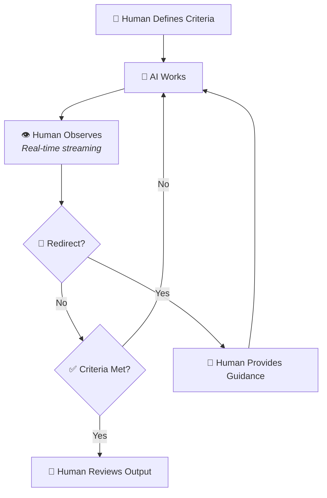

**Observed Bolt 특성:**

- AI 작업에 대한 실시간 가시성 (스트리밍 출력)
- 비차단 방식의 사람 참여—중단하지 않는 한 AI가 계속 진행
- 관찰 내용을 바탕으로 언제든지 방향 전환 가능
- AI의 속도와 사람의 판단력을 결합
- 교육적 가치—AI 작업을 관찰하며 패턴 학습 가능

**Observed Bolt 사용 시기:**

| 시나리오 | Observed가 적합한 이유 |
|----------|-------------------|
| UI/UX 구현 | 주관적 품질 판단—"저건 이상해 보여"를 즉시 말할 수 있음 |
| 콘텐츠 작성 | 어조와 문체 판단을 실시간으로 반영 가능 |
| 주니어 엔지니어 교육 | AI 작업 관찰을 통한 학습 기회 제공 |
| 탐색적 리팩터링 | 접근 방식이 잘못된 것 같으면 즉시 방향 전환 가능 |
| 디자인 시스템 작업 | 즉각적인 피드백이 미적 결정에 도움 |

#### Autonomous Bolt (AHOTL)

AI가 완료 기준을 충족할 때까지 테스트 결과와 품질 게이트를 피드백으로 활용하며 반복 작업합니다. 사람은 최종 결과물을 검토합니다. 프로그래밍 방식으로 검증 가능한 명확한 작업에 활용됩니다.


**Autonomous Bolt 특성:**

- 완료 신호 (`COMPLETE` 또는 `BLOCKED` 등)
- 안전망으로서의 최대 반복 횟수 제한
- 테스트, 타입 검사, 린팅을 통한 역압(backpressure)
- 파일 기반 진행 상태 유지
- 막혔을 때 차단 요인 문서화
- 실행 중 사람의 주의 불필요

하나의 Unit은 하나 이상의 Bolt를 통해 실행될 수 있으며, 병렬 또는 순차적으로 진행될 수 있습니다. AI가 Bolt를 계획하고, 개발자와 Product Owner가 해당 계획을 검증합니다.

#### 완료 기준 (Completion Criteria)

**완료 기준(Completion Criteria)**은 작업이 완료되었음을 정의하는 명시적이고 프로그래밍 방식으로 검증 가능한 조건입니다. AI가 반복 작업을 통해 달성해야 할 명확한 목표를 제시함으로써 자율 실행을 가능하게 합니다.

완료 기준은 다음 속성을 갖춰야 합니다:

| 속성 | 설명 | 예시 |
|-----------|-------------|---------|
| **구체적(Specific)** | 모호하지 않고 정확함 | "src/auth/의 커버리지 >80%" |
| **측정 가능(Measurable)** | 수치화하거나 이진 판단 가능 | "응답 시간 p95 <200ms" |
| **검증 가능(Verifiable)** | 프로그래밍 방식으로 확인 가능 | "TypeScript가 오류 없이 컴파일됨" |
| **독립적(Independent)** | 구현 방식을 규정하지 않음 | "비밀번호가 해시됨" (not "bcrypt 사용") |

완료 기준에 포함될 수 있는 항목:

- 테스트 통과 요건
- 코드 품질 임계값
- 성능 벤치마크
- 보안 스캔 결과
- 문서화 요건
- 통합 검증

#### 완료 공지 (Completion Announcements)

Intent가 완료되더라도 작업이 끝난 것이 아닙니다—이를 외부에 알려야 합니다. AI-DLC 2026은 **완료 공지(Completion Announcements)**를 일급 아티팩트로 포함합니다.

Mob Elaboration 과정에서 팀은 공지 형식을 지정합니다:

```yaml
# intent.md frontmatter
announcements:
  - changelog      # Conventional changelog entry
  - release-notes  # User-facing summary
  - social-posts   # Twitter/LinkedIn ready
  - blog-draft     # Long-form announcement
```

완료 시 AI는 설정된 각 형식에 맞게 공지를 생성합니다:

| 형식 | 목적 | 대상 |
|--------|---------|----------|
| **CHANGELOG** | 변경 사항의 기술적 기록 | 개발자 |
| **릴리스 노트** | 사용자 대상 기능 요약 | 최종 사용자 |
| **소셜 포스트** | 플랫폼 최적화 스니펫 | 커뮤니티 |
| **블로그 초안** | 상세 공지 | 마케팅 |

**이것이 중요한 이유:** 커뮤니케이션 없이 기능을 출시하는 것은 미완성 작업입니다. 공지 아티팩트는 완료된 모든 Intent에 적절한 릴리스 커뮤니케이션에 필요한 자료가 갖춰지도록 보장하여, "코드 완료"와 "사용자가 인지"하는 시점 사이의 간격을 줄여줍니다.

#### 배포 단위 (Deployment Unit)

**배포 단위(Deployment Units)**는 프로덕션 운영에 필요한 모든 것을 포함하는 운영 아티팩트입니다:

- **코드 아티팩트:** 컨테이너 이미지, 서버리스 함수 패키지, 컴파일된 바이너리
- **구성:** Helm 차트, 환경 설정, 피처 플래그
- **인프라:** Terraform 모듈, CloudFormation 스택, Pulumi 프로그램
- **검증:** 기능, 보안, 성능 검증을 위한 테스트 스위트

AI는 다음을 포함한 모든 관련 테스트를 생성합니다:

- 비즈니스 요건을 검증하는 기능 인수 테스트
- 보안 스캔 (정적 분석, 의존성 취약점, SAST/DAST)
- NFR 임계값 대비 성능 및 부하 테스트
- 인프라 검증 및 컴플라이언스 점검

사람이 테스트 시나리오와 케이스를 검증한 후, AI가 테스트 스위트를 실행하고 결과를 분석하며 실패를 코드 변경, 구성 또는 의존성과 연관 지어 파악합니다. 배포 단위는 기능 인수, 보안 컴플라이언스, NFR 준수, 운영 리스크 완화 측면에서 테스트되어 원활한 배포를 위한 준비 상태를 보장합니다.

배포 단위는 독립적으로 배포 가능해야 하며 자동화된 롤백 절차를 포함해야 합니다.

---

### 단계 및 의식(Rituals)

AI-DLC 2026은 작업을 세 단계로 구성하며, 각 단계마다 고유한 의식과 인간-AI 상호작용 패턴이 있습니다.

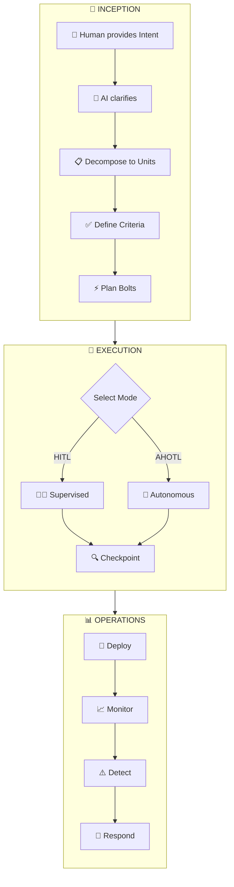

#### Inception 단계

Inception 단계는 Intent를 포착하고, 이를 명확한 완료 기준(Completion Criteria)이 있는 Unit으로 변환하여 개발에 활용하는 데 초점을 맞춥니다.

**Mob Elaboration 의식**

Inception의 핵심 의식은 **Mob Elaboration**입니다. 이는 이해관계자와 AI가 함께 협력하여 요구사항을 구체화하고 분해하는 세션으로, 공유 화면이 있는 같은 공간에서 또는 협업 도구를 통해 진행됩니다.

Mob Elaboration 진행 과정:

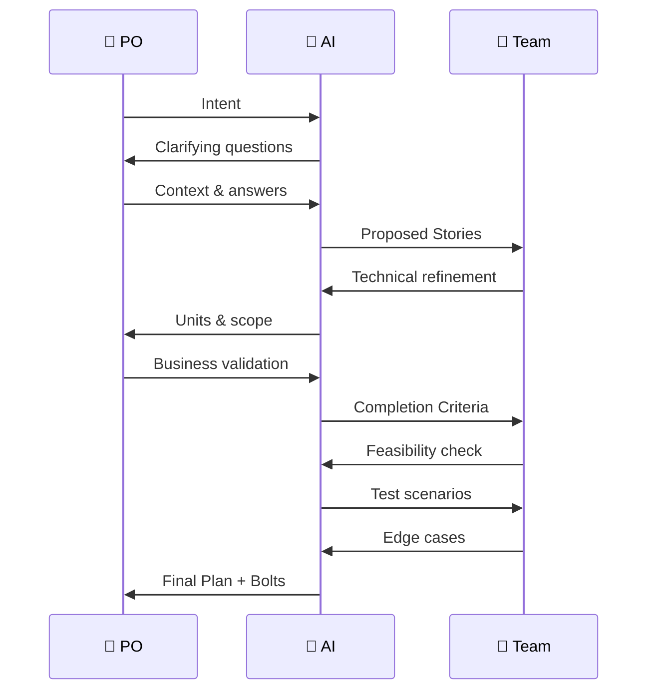

1. **AI가 명확화 질문을 제시**하여 원래 Intent의 모호성을 최소화합니다
2. **AI가 명확화된 의도를 구체화**하여 사용자 스토리, NFR, 리스크 설명으로 발전시킵니다
3. **AI가 Unit을 구성**합니다. 응집도 분석을 기반으로 연관성이 높은 스토리를 그룹화합니다
4. **팀이 산출물을 검토**하고 수정 및 조정 사항을 제공합니다
5. **AI가 각 Unit에 대한 완료 기준을 생성**하여 자율 실행이 가능하도록 합니다
6. **팀이 기준을 검증**하여 검증 가능하고 완전한지 확인합니다
7. **AI가 Bolt 구조와 모드**(감독 방식 vs 자율 방식)를 각 Unit에 대해 권장합니다

**Mob Elaboration은 순차적으로 진행하면 수 주가 걸리는 작업을 몇 시간으로 압축**하면서도 이해관계자와 AI 간의 깊은 정렬을 달성합니다.

**Inception의 산출물:**

- 명확한 경계를 가진 잘 정의된 Unit
- 인수 기준이 포함된 사용자 스토리
- 비기능 요구사항(NFR)
- 리스크 설명(조직의 리스크 프레임워크와 연계)
- 완료 기준(테스트, 임계값, 검사 항목)
- 비즈니스 Intent와 연결된 측정 기준
- 모드 권장 사항이 포함된 제안 Bolt
- Pass 구조(다단계 반복이 필요한 경우)
- 프로젝트 인텔리전스를 담은 지식 산출물(설계, 아키텍처, 제품, 컨벤션, 도메인)

**프로젝트 지식 레이어**

구체화 작업은 백지 상태에서 시작하는 것이 아니라 축적된 프로젝트 인텔리전스를 기반으로 합니다. AI-DLC는 **지식 레이어(Knowledge Layer)**를 유지합니다. 이는 `.ai-dlc/knowledge/` 경로에 저장되는 구조화된 산출물 집합으로, Intent 전반에 걸쳐 지속되며 특정 Intent가 *무엇을 구축하는지*와는 별개로 프로젝트가 *무엇인지*를 포착합니다.

지식 레이어는 다섯 가지 산출물 유형으로 구성됩니다:

| 산출물 | 포착 내용 |
|----------|-----------------|
| **design** | 시각적 언어, 컴포넌트 패턴, 디자인 토큰, 레이아웃 컨벤션 |
| **architecture** | 시스템 구조, 모듈 경계, 데이터 흐름, 기술 선택 |
| **product** | 비즈니스 규칙, 사용자 페르소나, 도메인 어휘, 기능 목록 |
| **conventions** | 코딩 표준, 네이밍 패턴, 파일 구성, 툴링 설정 |
| **domain** | 도메인 모델, 엔티티 관계, 바운디드 컨텍스트, 유비쿼터스 언어 |

**브라운필드(brownfield) 프로젝트**의 경우, 지식 산출물은 자동화된 합성 과정을 통해 채워집니다. 서브에이전트가 코드베이스를 스캔하고 대표적인 파일을 샘플링하여 패턴을 신뢰도 점수와 함께 구조화된 산출물로 정제합니다. 이 과정은 구체화 초기(도메인 탐색 이전)에 진행되므로, 이후 단계들이 기존 프로젝트 컨텍스트를 재발견하는 대신 그 위에서 구축될 수 있습니다.

**그린필드(greenfield) 프로젝트**의 경우, 지식 산출물은 빈 스캐폴드로 시작하여 Design Direction 단계를 통해 초기값이 채워집니다. 이 단계에서 팀은 시각적 아키타입을 선택하고 디자인 파라미터를 조정하여, 구현이 시작되기 전에 프로젝트의 미적 기반을 확립합니다.

지식 산출물은 라이프사이클의 두 시점에서 갱신됩니다. 구체화 단계(도메인 탐색 이전, 이후 단계가 기존 컨텍스트 위에서 구축될 수 있도록)와 통합 이후(Intent가 완료되고 모든 Unit이 병합된 시점)입니다. 통합 후 갱신은 그린필드 격차를 해소하는 역할을 합니다. 첫 번째 Intent가 기반 코드베이스 패턴을 구축하면, 갱신 과정이 이를 지식 산출물로 포착하여 다음 Intent가 시작되기 전에 반영합니다. 이를 통해 프로젝트의 다섯 번째 Intent는 앞선 네 개의 Intent에서 확립된 모든 것을 활용할 수 있습니다. 실행 워크플로우의 모든 hat은 관련 지식 산출물을 읽어들이므로, 프로젝트에 축적된 인텔리전스는 일급 메모리 레이어로 기능합니다. 이는 Memory Providers 원칙의 실질적인 확장입니다.

**Design Direction**

그린필드 프로젝트는 콜드 스타트 문제에 직면합니다. 학습할 기존 패턴이 없으며, 첫 번째 Intent에서 내린 설계 결정이 이후 모든 것의 형태를 결정합니다. AI-DLC는 구체화 단계 중 **Design Direction** 단계를 통해 이 문제를 해결합니다.

기존 디자인 지식이 없는 그린필드 또는 초기 단계 프로젝트를 구체화할 때, 워크플로우는 디자인 방향 선택기를 제시합니다. 이는 팀이 디자인 아키타입(예: Brutalist, Editorial, Dense/Utilitarian, Playful/Warm) 중에서 선택하고, 밀도, 테두리 처리, 색온도, 타이포그래피 대비 등의 파라미터를 조정할 수 있는 시각적 인터페이스입니다. 선택 결과로 **디자인 블루프린트**가 생성됩니다. 이는 와이어프레임 생성을 안내하고 빌더 컨텍스트에 정보를 제공하기에 충분히 구체적인 방식으로 프로젝트의 시각적 언어를 정의하는 구조화된 산출물입니다.

설계 청사진은 `design` 아티팩트로 지식 레이어에 반영되어 Intent 전반에 걸쳐 유지됩니다. 이후의 구체화 사이클은 설계 방향을 다시 결정하는 대신 확립된 설계 방향을 그대로 이어받아, 기능 전반에 걸쳐 시각적 일관성을 제공합니다. 청사진은 와이어프레임 생성과 hat 컨텍스트에도 반영되어, 착수 단계에서 내려진 설계 결정이 구축 단계까지 전파됩니다.

이 단계는 설계 지식 아티팩트가 이미 존재하는 기성 프로젝트에서는 건너뜁니다. 기존 패턴만으로도 새로운 작업을 충분히 안내할 수 있기 때문입니다.

**멀티-Pass 구체화**

교차 기능 반복이 필요한 Intent의 경우, Mob Elaboration은 Pass 구조도 정의합니다. 각 Pass는 자체적인 구체화 사이클을 갖습니다:

1. **Design pass 구체화:** 디자인 및 제품 이해관계자가 화면, 플로우, 컴포넌트, 인터랙션 등 디자인 Unit을 정의합니다. 산출물: product pass의 입력 컨텍스트가 되는 디자인 아티팩트.
2. **Product pass 구체화:** 제품 담당자가 완성된 디자인을 검토하고, 인수 기준을 작성하며, 동작 상의 누락 사항과 엣지 케이스를 식별합니다. 산출물: dev pass의 입력 컨텍스트가 되는 주석이 달린 디자인 및 동작 명세.
3. **Dev pass 구체화:** 전체 교차 기능 팀(제품, 디자인, 개발)이 디자인 아티팩트와 동작 명세를 입력으로 삼아 dev Unit을 구체화합니다. 산출물: 실행 준비가 완료된 dev Unit.

각 Pass 구체화는 참여자와 입력이 다를 뿐, 동일한 Mob Elaboration 의식을 수행합니다. Intent는 전 과정에서 동일하게 유지되며, Pass는 서로 다른 관점을 통해 Intent를 정제합니다.

**구체화 단계 순서**

단일 구체화 사이클 내에서 작업은 정해진 단계 순서에 따라 진행됩니다. 핵심 단계(Intent 포착, 명확화, 도메인 탐색, 분해, 기준 정의)는 조건부로 실행되는 두 가지 컨텍스트 구축 단계로 보완됩니다:

- **지식 부트스트랩 (Phase 2.3):** 도메인 탐색 이전에 실행됩니다. 브라운필드 프로젝트의 경우 기존 코드베이스에서 지식 아티팩트를 합성하고, 그린필드 프로젝트의 경우 스캐폴드 아티팩트를 작성합니다. 이를 통해 도메인 탐색이 처음부터 시작하는 대신 축적된 프로젝트 인텔리전스를 기반으로 진행될 수 있습니다. 보완적인 **통합 후 갱신(post-integrate refresh)** 은 각 Intent가 완료된 후 실행되어, 병합된 코드베이스에서 지식을 재합성함으로써 다음 Intent의 부트스트랩 단계가 최신 아티팩트로 시작할 수 있도록 합니다.
- **설계 방향 (Phase 2.75):** 도메인 탐색 이후, 워크플로우 선택 이전에 실행됩니다. 설계 지식이 없는 그린필드 또는 초기 단계 프로젝트의 경우 설계 방향 선택기를 제시합니다. 기성 프로젝트의 경우 건너뜁니다. 기존 설계 지식으로 충분하기 때문입니다.

두 단계 모두 자동으로 실행되며 별도의 명시적 호출이 필요하지 않습니다. 프로젝트 성숙도와 기존 지식 상태에 따라 활성화되는 조건부 단계로서 구체화 흐름에 통합됩니다.

#### 실행 단계

실행 단계는 Bolt를 통해 Unit을 테스트 완료된 배포 준비 아티팩트로 변환합니다. 이 단계는 도메인 모델링, 논리적 설계, 코드 생성, 테스트를 거쳐 진행되지만, 복잡도에 따라 이러한 단계들이 명시적이지 않고 암묵적으로 처리될 수도 있습니다.

**Intent에 여러 Pass가 있는 경우,** 실행은 한 번에 하나의 Pass씩 진행합니다. 활성 Pass의 Unit이 실행, 검토, 완료된 후에야 다음 Pass의 구체화가 시작됩니다. 이후 Pass에서 나온 피드백은 이전 Pass를 재활성화하여 Intent를 정제를 위해 되돌릴 수 있습니다. 이는 예상된 반복이며 실패가 아닙니다.

**모드 선택**

실행의 첫 번째 결정은 각 Bolt에 대한 모드 선택입니다:

| 감독 모드(HITL) 선택 시기... | 자율 모드(AHOTL) 선택 시기... |
|----------------------------------|-----------------------------------|
| 새로운 도메인 또는 아키텍처 | 잘 이해된 패턴 |
| 복잡한 트레이드오프 필요 | 명확한 인수 기준 |
| 고위험 변경 사항 | 프로그래밍 방식의 검증 가능 |
| 창의적 또는 UX 중심 작업 | 기계적 변환 |
| 기반 결정 사항 | 배치 작업 |

**감독 실행 (HITL)**

새로운 도메인, 아키텍처 결정, 또는 높은 판단력이 요구되는 작업의 경우:

1. 개발자가 AI와 세션을 시작합니다
2. AI가 도메인 모델을 제안하고, 개발자가 비즈니스 로직을 검증합니다
3. AI가 논리적 아키텍처를 제안하고, 개발자가 트레이드오프 결정을 내립니다
4. AI가 코드를 생성하고, 개발자가 품질과 정합성을 검토합니다
5. AI가 테스트를 생성하고, 개발자가 시나리오와 엣지 케이스를 검증합니다
6. 각 단계마다 사람의 체크포인트를 거치며 인수 기준이 충족될 때까지 반복합니다

**자율 실행 (AHOTL)**

프로그래밍 방식의 검증이 가능한 명확하게 정의된 작업의 경우:

```markdown
Implement the user authentication API endpoints.

Context:
- Specs in specs/auth-api.md
- Existing middleware in src/middleware/
- Database models in src/models/user.ts

Completion Criteria:
- All tests in tests/auth/ pass
- TypeScript compiles with strict mode: no errors
- ESLint passes with 0 warnings
- Coverage >85% for src/auth/
- Security scan: no critical/high findings
- Load test: 100 concurrent requests in <2s

Process:
1. Read all relevant specs and existing code
2. Write tests first based on acceptance criteria
3. Implement to pass tests
4. Run full verification suite
5. Fix any failures
6. Iterate until all criteria pass

Constraints:
- Maximum 50 iterations
- Only modify files in src/auth/, tests/auth/
- Commit after each working increment

If blocked after 10 attempts on same issue:
- Document in .agent/blockers.md
- Output BLOCKED

When all criteria pass:
- Output COMPLETE
```

**자율 작업에 대한 사람의 검토:**

- 생성된 코드의 아키텍처 정합성 검토
- 설계 결정 사항 검증 (예: 캐싱 전략)
- 테스트에서 다루지 않은 엣지 케이스 확인
- 통합 승인 또는 변경 요청

**Mob Execution 의식**

여러 Unit을 병렬로 구축해야 하는 복잡한 시스템의 경우:

1. 팀이 AI 에이전트와 함께 집결합니다 (물리적 또는 가상)
2. 각 팀이 Unit의 소유권을 맡습니다
3. 팀 간에 통합 명세를 교환합니다 (API 계약, 이벤트 스키마)
4. 자율 Bolt가 각 Unit 내에서 병렬로 실행됩니다
5. 사람의 체크포인트가 Unit 간 관심사를 조율합니다
6. 통합 테스트가 Unit 간 경계를 검증합니다

#### 운영 단계

운영 단계는 실행이 완료된 후 지속적인 운영 작업을 관리합니다. AI-DLC는 운영을 외부적인 관심사로 취급하는 대신, 운영 작업을 지원 대상 코드와 함께 위치하는 파일 기반 스펙으로 모델링합니다.

**스펙으로서의 운영:**

운영은 `.ai-dlc/{intent}/operations/` 경로에 YAML 프론트매터를 포함한 Markdown 파일로 정의됩니다. 각 운영 스펙은 유형, 소유권 모델, 실행 파라미터를 선언합니다:

```markdown
---
name: scale-on-load
type: reactive
owner: agent
trigger: "p99_latency > 200ms for 5m"
runtime: node
---

Scale API replicas when latency exceeds threshold.

Check current replica count, compute target based on
request rate, and apply scaling via kubectl.
```

**운영 유형:**

- **Scheduled** — 크론 기반 작업 (시크릿 교체, 캐시 워밍, 보고서 생성)
- **Reactive** — 트리거 기반 대응 (자동 스케일링, 오류 급증 시 롤백, 인증서 갱신)
- **Process** — 사람 주기의 작업 (분기별 보안 검토, 용량 계획, 컴플라이언스 감사)

**소유권 모델:**

- **에이전트 소유** — 동반 파일(`.ts`, `.py`, `.sh`)을 갖춘 자동화 스크립트. AI가 정의된 범위 내에서 자율적으로 실행합니다.
- **사람 소유** — 체크리스트 기반 런북. AI가 체크리스트를 제시하고 완료 여부를 추적하지만, 실제 작업은 사람이 수행합니다.

**`/ai-dlc:operate` 명령어:**

모든 운영 작업을 관리하는 통합 인터페이스입니다:

- `/ai-dlc:operate` — 모든 Intent에 걸친 운영 목록 조회
- `/ai-dlc:operate {intent}` — 특정 Intent의 운영 상태 테이블 조회
- `/ai-dlc:operate {intent} {operation}` — 에이전트 스크립트 실행 또는 사람용 체크리스트 표시
- `/ai-dlc:operate {intent} --deploy [target]` — 배포 매니페스트 생성 (Kubernetes CronJob, GitHub Actions, Docker Compose, systemd)
- `/ai-dlc:operate {intent} --status` — 타임스탬프 포함 헬스 체크
- `/ai-dlc:operate {intent} --teardown` — 스펙은 보존하면서 배포 제거

**상태 지속성:**

운영은 `.ai-dlc/{intent}/state/operation-status.json`에 상태를 기록하며, 마지막 실행 시간, 상태(`on-track`, `needs-attention`, `failed`, `pending`, `torn-down`), 배포 상태, 대상 플랫폼을 저장합니다. 이를 통해 Integrator가 Unit 전반에 걸쳐 운영 준비 상태를 검증할 수 있습니다.

**실행과의 통합:**

Builder hat은 작업에 지속적인 유지보수가 필요한 경우 프로덕션 단계에서 운영 스펙을 생성합니다. Reviewer hat은 리뷰의 일환으로 운영 준비 상태를 검증합니다. Integration 스킬은 Unit 간 충돌—스케줄 충돌, 트리거 중복, 공유 리소스 참조—을 확인하여 Intent 전반에 걸쳐 운영이 올바르게 구성되도록 보장합니다.

**스택 구성:**

운영은 `.ai-dlc/settings.yml`에 정의된 프로젝트의 인프라 스택과 통합됩니다. `stack.operations` 레이어는 런타임 환경(지정하지 않은 경우 프로젝트 파일에서 자동 감지), 스케줄 작업 구성, 리액티브 핸들러 설정을 선언합니다. 이를 통해 `/ai-dlc:operate --deploy`가 플랫폼에 적합한 매니페스트를 생성할 수 있습니다.

---

### 워크플로우

완전한 AI-DLC 2026 워크플로우는 모든 단계를 하나의 연속적인 흐름으로 통합합니다:

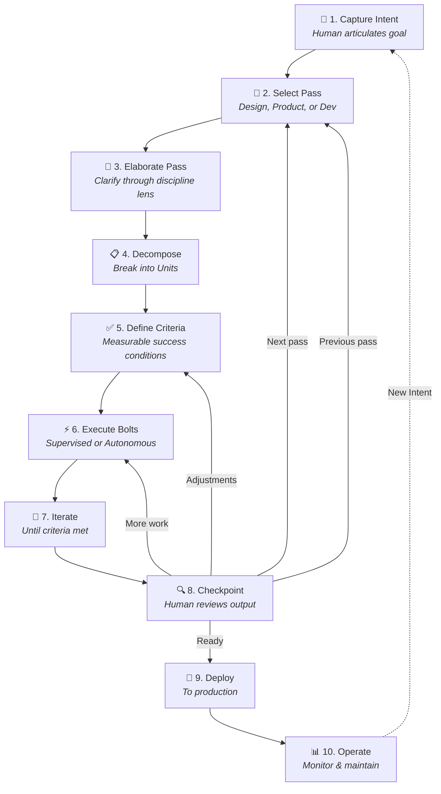

**워크플로우의 핵심 원칙:**

- **각 단계는 다음 단계를 위한 컨텍스트를 풍부하게 합니다:** 아티팩트는 점진적으로 구축되며, 각 단계는 의미론적으로 더 풍부한 컨텍스트를 생성합니다
- **파일이 메모리입니다:** 진행 상황은 대화가 아닌 수정된 파일과 커밋에 지속됩니다
- **체크포인트는 조정을 가능하게 합니다:** 사람의 검토 시점에서 처음부터 재시작하지 않고도 작업 방향을 전환할 수 있습니다
- **흐름이 단계를 대체합니다:** 명확한 인계 대신, 전략적 시점에 사람의 감독을 두고 작업이 지속적으로 흐릅니다
- **Pass는 교차 기능적 반복을 가능하게 합니다:** 동일한 루프가 디자인, 프로덕트, 개발에 걸쳐 실행되며, 각각 다른 관점으로 Intent를 정제합니다
- **역방향 흐름은 예상된 것입니다:** 개발 Pass에서 제약을 발견하여 작업이 디자인 Pass로 되돌아가는 것은 정상적인 반복이지 실패가 아닙니다
- **추적 가능성이 유지됩니다:** 모든 아티팩트는 서로 연결되어 Pass 전반에 걸쳐 순방향 및 역방향 추적이 가능합니다

### 라이프사이클 진입 지점

위에서 설명한 워크플로우는 그린필드 착수, 즉 팀이 새로운 아이디어나 요구사항을 가지고 처음부터 시작하는 상황을 전제로 합니다. 그러나 실제 팀은 AI-DLC 라이프사이클에 진입하는 다양한 방법이 필요합니다. 모든 기능이 백지 상태에서 시작되는 것은 아니며, 일부는 이전 작업을 반복 개선하고, 또 다른 일부는 AI-DLC 도입 이전부터 존재하던 것들입니다.

| 진입 지점 | 사용 시점 | 산출물 | 라이프사이클 진입 위치 |
|-------------|-------------|------------------|-------------------------------|
| **Elaborate** | 새로운 아이디어나 요구사항을 처음부터 시작할 때 | Intent, units, Mob Elaboration을 통한 발견 | 착수 단계 |
| **Follow Up** | 이미 라이프사이클을 거친 이전 intent를 반복 개선할 때 | 이전 intent에 `iterates_on`으로 연결된 새로운 intent | 이전 컨텍스트를 포함한 착수 단계 |
| **Adopt** | AI-DLC 외부에서 구축된 기존 기능을 역공학할 때 | 완성된 intent, units, 발견 결과, 운영 계획 | 운영 단계 (코드가 이미 존재하므로 구축 단계 생략) |

**Adoption**은 흔히 발생하는 공백을 해결합니다. AI-DLC 도입 이전에 구축되었거나 AI-DLC 없이 구축된 기능들은 intent 아티팩트, unit 분해, 운영 계획이 없습니다. 이러한 아티팩트가 없으면 해당 기능은 지속적인 운영 관리를 위한 `/ai-dlc:operate`나 구조화된 반복 개선을 위한 `/ai-dlc:followup`에 참여할 수 없습니다. Adoption은 코드베이스, git 히스토리, 테스트, CI 구성으로부터 아티팩트를 역공학하여 이 공백을 해소합니다.

adoption을 통해 생성된 모든 아티팩트는 기능이 이미 존재하기 때문에 `status: completed`를 가집니다. 코드가 이미 작성, 테스트, 배포된 상태이므로 구축 단계는 없습니다. 대신 adoption은 기존 구현을 분석하여 elaboration과 구축 단계에서 생성되었을 것과 동일한 아티팩트 구조를 만들어내며, 이를 통해 해당 기능이 운영 단계에서 라이프사이클에 진입할 수 있게 합니다. 사용자는 여러 게이트에서 제안된 분해 결과를 확인합니다: intent 및 unit 분류, 추적 가능한 테스트 근거를 갖춘 성공 기준, 그리고 운영 계획.

이로써 adoption은 기존 시스템을 AI-DLC 거버넌스 체계로 편입하려는 팀의 주요 온램프가 됩니다. 브라운필드 컨텍스트 구축의 구체적인 예시는 [브라운필드 개발](#ai-dlc-2026-in-action-brownfield-development) 섹션을 참조하십시오.

---

## AI-DLC 2026 실전: 그린필드 개발

**시나리오:** 제품 책임자가 교차 판매 상품을 위한 추천 엔진 개발을 시작합니다.

### 착수 단계 (Mob Elaboration)

**사람이 Intent를 제공합니다:**

```markdown
## Intent: Product Recommendation Engine

Build a recommendation engine that suggests complementary products
based on purchase history and browsing behavior.

### Initial Context
- E-commerce platform with 50,000 products
- 1 million monthly active users
- Need real-time recommendations (<100ms)
- Must integrate with existing product catalog API
- GDPR compliance required for EU users
```

**AI가 명확화 질문을 합니다:**

> "이 Intent를 구체화하는 데 도움을 드리겠습니다. 몇 가지 명확화 질문을 드리겠습니다:
>
> - 어떤 추천 방식을 고려해야 할까요? 협업 필터링, 콘텐츠 기반, 또는 하이브리드 방식인가요?
> - 개인화의 깊이는 어느 정도를 기대하시나요? 사용자별 추천인가요, 아니면 세그먼트 기반인가요?
> - 추천이 표시될 위치는 어디인가요? 상품 페이지, 장바구니, 결제, 이메일인가요?
> - 이력이 없는 신규 사용자에 대한 콜드 스타트 전략은 무엇인가요?
> - 함께 추천되어서는 안 되는 상품이 있나요?"

**팀이 답변을 제공하면 AI가 의존성을 포함한 Units로 구체화합니다:**

```
unit-01-data-collection ──→ unit-02-model ──┐
                                            ├──→ unit-04-frontend
                       unit-03-api ─────────┘
```

**unit-01-data-collection.md** (`depends_on: []`)
사용자 행동(조회, 클릭, 구매)을 수집하고, 피처 파이프라인을 구축하며, 사용자 및 상품 임베딩을 생성합니다.

완료 기준:

- 이벤트 추적이 조회, 클릭, 장바구니 추가, 구매를 캡처함
- 이벤트가 30초 미만의 지연으로 파이프라인을 통해 흐름
- 사용자 임베딩이 매일 밤 업데이트됨
- 데이터 보존이 GDPR을 준수함 (동의, 삭제)

**unit-02-model.md** (`depends_on: [unit-01-data-collection]`)
상품 추천을 위한 ML 모델을 학습하고 서빙합니다. unit-01의 데이터 파이프라인이 필요합니다.

완료 기준:

- 모델이 홀드아웃 세트에서 AUC >0.75 달성
- 추론 지연 시간 p99 기준 50ms 미만
- A/B 테스트 프레임워크 통합
- 모델 재학습 파이프라인 자동화

**unit-03-api.md** (`depends_on: []`)
상품 카탈로그와 통합된 실시간 서빙 API입니다. unit-01과 병렬로 시작할 수 있습니다.

완료 기준:

- GET /recommendations/{userId}가 상위 10개 상품을 반환함
- 1000 req/s 부하에서 응답 시간 p99 기준 100ms 미만
- 카탈로그 API에 대한 통합 테스트 통과
- 속도 제한: 사용자당 분당 1000 요청
- 기존 JWT 토큰을 통한 인증

**unit-04-frontend.md** (`depends_on: [unit-02-model, unit-03-api]`)
상품 페이지와 장바구니에 추천을 표시합니다. 팬인: 모델과 API 모두 필요합니다.

완료 기준:

- 추천 위젯이 상품 페이지에 렌더링됨
- 위젯이 로딩, 오류, 빈 상태를 처리함
- 클릭 추적이 분석 도구와 통합됨
- A/B 테스트 변형 지원
- 접근성: WCAG 2.1 AA 준수

**병렬 실행:** unit-01-data-collection과 unit-03-api는 즉시 시작됩니다(의존성 없음). unit-02-model은 unit-01-data-collection을 기다립니다. unit-04-frontend는 unit-02-model과 unit-03-api 모두를 기다립니다(팬인 지점).

**적대적 사양 검토:** 실행에 넘기기 전에 elaboration 워크플로우는 intent 및 unit 사양에 대한 적대적 검토를 수행합니다. 객관성을 위해 elaboration 대화와 격리된 전용 서브에이전트가 일곱 가지 범주에 걸쳐 사양에 이의를 제기합니다: units 간 모순, 숨겨진 복잡성, 검증되지 않은 가정, 의존성 순서 오류, 범위 확장, 완전성 공백, 경계 위반. 신뢰도가 높은 기계적 수정 사항(누락된 의존성 추가, 기준 추가)은 자동으로 적용되며, 그 외 모든 발견 사항은 팀의 결정을 위해 제시됩니다. 이를 통해 실행이 시작되기 전에 수정하는 것이 훨씬 저렴한 사양 수준의 문제를 사전에 발견합니다.

**AI가 Bolt 모드를 추천합니다:**

| Unit | 추천 모드 | 근거 |
|------|------------------|-----------|
| unit-01-data-collection | 자율 (AHOTL) | 명확한 기준, 확립된 패턴 |
| unit-02-model | 감독 (HITL) | 새로운 ML 의사결정, 트레이드오프 |
| unit-03-api | 자율 (AHOTL) | 표준 REST 패턴, 명확한 기준 |
| unit-04-frontend | 감독 (HITL) | UX 의사결정, 접근성 판단 |

### 실행 단계

**Unit 3 (API 통합)이 자율 Bolt로 실행 배정됨.**

자율 모드 선택 근거:

- 명확한 완료 기준 (응답 시간, 테스트 커버리지, 보안)
- 잘 이해된 도메인 (REST API 개발)
- 강력한 프로그래밍 방식의 검증 (테스트, 부하 테스트, 보안 스캔)

**AI 실행 추적:**

1. 스펙 및 기존 코드를 읽고 컨텍스트 파악
2. `/recommendations/{userId}`에 대한 API 엔드포인트 테스트 작성
3. 기본 추천 로직을 포함한 엔드포인트 구현
4. 테스트 실패 — 카탈로그 통합 누락
5. 카탈로그 클라이언트 통합 구현
6. 테스트 통과
7. 부하 테스트 800 req/s에서 실패 (목표: 1000)
8. Redis 캐싱 레이어 추가
9. 부하 테스트 통과: 1200 req/s, p99 85ms
10. 보안 스캔: 쿼리 파라미터에서 SQL 인젝션 위험 발견
11. 파라미터화된 쿼리로 수정
12. 모든 기준 충족
13. `COMPLETE` 출력

**사람이 자율 실행 결과물을 검토합니다:**

- 코드 리뷰에서 우수한 아키텍처 결정 확인
- 캐싱 전략이 사용 사례에 적합
- 테스트 커버리지 충분
- 통합 승인

### 운영 단계

실행 중에 Builder는 추천 엔진의 지속적인 유지보수를 위한 운영 스펙을 생성했습니다:

**`.ai-dlc/rec-engine/operations/scale-api.md`** — 반응형, 에이전트 소유:

```markdown
---
name: scale-api
type: reactive
owner: agent
trigger: "p99_latency > 150ms for 5m"
runtime: node
---

Scale API replicas when latency exceeds threshold.
Check current load, compute target replicas, apply via kubectl.
```

**`.ai-dlc/rec-engine/operations/rollback-deployment.md`** — 반응형, 에이전트 소유:

```markdown
---
name: rollback-deployment
type: reactive
owner: agent
trigger: "error_rate > 2% for 5m"
---

Roll back to previous deployment version.
Capture current version, kubectl rollout undo, verify health.
```

**`.ai-dlc/rec-engine/operations/review-recommendation-quality.md`** — 프로세스, 사람 소유:

```markdown
---
name: review-recommendation-quality
type: process
owner: human
frequency: quarterly
---

- [ ] Pull click-through rate trends from analytics dashboard
- [ ] Compare against baseline (established at launch)
- [ ] Review model drift metrics
- [ ] Decide: retrain, adjust weights, or no action
- [ ] Document decision in ADR
```

**`/ai-dlc:operate`로 운영 관리:**

```
$ /ai-dlc:operate rec-engine
┌─────────────────────────────────┬──────────┬───────┬────────────┐
│ Operation                       │ Type     │ Owner │ Status     │
├─────────────────────────────────┼──────────┼───────┼────────────┤
│ scale-api                       │ reactive │ agent │ on-track   │
│ rollback-deployment             │ reactive │ agent │ on-track   │
│ review-recommendation-quality   │ process  │ human │ pending    │
└─────────────────────────────────┴──────────┴───────┴────────────┘

$ /ai-dlc:operate rec-engine --deploy k8s-deployment
Generated: .ai-dlc/rec-engine/operations/scale-api.deploy.yaml
Generated: .ai-dlc/rec-engine/operations/rollback-deployment.deploy.yaml
```

---

## 실전 AI-DLC 2026: 브라운필드 개발

**시나리오:** 기존 이커머스 애플리케이션에 새로운 위시리스트 기능 추가.

### 핵심 차이점: 컨텍스트 구축

Inception 전에 AI는 기존 코드베이스를 이해해야 합니다. AI-DLC는 이를 엘라보레이션의 Knowledge Bootstrap 단계를 통해 자동화하며, 코드베이스를 스캔하여 아키텍처 패턴, 설계 관례, 도메인 모델, 코딩 표준으로부터 지식 아티팩트를 합성합니다. 이 아티팩트들은 `.ai-dlc/knowledge/`에 저장되어 이후의 모든 엘라보레이션 및 실행에 활용됩니다. 더 심층적인 분석이 필요한 팀의 경우, 이 컨텍스트 구축을 명시적인 자율 Bolt로 수행할 수도 있습니다:

**자율 컨텍스트 구축:**

```markdown
Analyze existing codebase and generate context models.

Tasks:

1. Identify major components in src/
2. Map dependencies between components
3. Document data flows for checkout and user profile
4. Identify integration points for new features
5. Note patterns and conventions used

Output:


- docs/architecture/static-model.md (components, responsibilities, relationships)
- docs/architecture/dynamic-model.md (key use case flows)
- docs/architecture/integration-points.md (where new features connect)
- docs/architecture/conventions.md (patterns to follow)

Output ANALYSIS_COMPLETE when done.
```

**정적 모델**이 캡처하는 내용: 컴포넌트, 설명, 책임, 관계
**동적 모델**이 캡처하는 내용: 주요 유스케이스에서 컴포넌트가 상호작용하는 방식

컨텍스트 구축 후 Inception은 정상적으로 진행되지만, 기존 패턴과 제약 사항을 인식한 상태로 이루어집니다. AI의 제안은 확립된 관례에 맞게 조정되며, 완료 기준은 기존 테스트 패턴을 참조합니다.

### 사전 착수 산출물

AI는 브라운필드 작업 중에도 조직의 기억 저장소를 조회할 수 있습니다:

- **티켓 이력 조회:** "사용자 환경설정과 관련된 과거 이슈는 무엇인가?"
- **ADR 조회:** "데이터 저장 패턴에 대해 어떤 결정이 내려졌는가?"
- **런북 조회:** "사용자 대면 기능에 대한 운영상 고려사항은 무엇인가?"

이러한 맥락은 Inception 단계에 반영되어, 새로운 작업이 기존 결정과 일치하고 과거의 실수를 반복하지 않도록 보장합니다.

---

## 의사결정 프레임워크: 운영 모드 선택

올바른 운영 모드를 선택하는 것은 AI-DLC 성공의 핵심입니다. 모드 선택은 기준의 명확성, 검증 방법, 위험 수준, 도메인 친숙도, 그리고 주관적 품질의 중요성 여부에 따라 결정됩니다.

**핵심 원칙:** 불확실할 때는 더 많은 감독을 기본값으로 삼으십시오. 통제를 완화하는 것이 자율적 실수로부터 회복하는 것보다 훨씬 쉽습니다.

| 시나리오 | 모드 | 근거 |
|----------|------|------|
| 새 알고리즘 구현 | 감독형 (HITL) | 새로운 작업으로 판단이 필요함 |
| CRUD 엔드포인트 추가 | 자율형 (AHOTL) | 잘 이해된 패턴 |
| 데이터베이스 스키마 마이그레이션 | 감독형 (HITL) | 고위험, 데이터 무결성 |
| UI 컴포넌트 구현 | 관찰형 (OHOTL) | 주관적 디자인 품질 |
| 문서 업데이트 | 자율형 (AHOTL) | 명확한 기준, 낮은 위험 |

작업에 대한 이해가 깊어짐에 따라 모드 간 전환이 가능합니다. 작업 중간에 모드를 전환할 수 있는 유연성은 AI-DLC 2026의 핵심 기능입니다.

**→ 완전한 의사결정 트리와 전환 트리거는 [모드 선택 런북](./ai-dlc-2026/runbooks/construction/mode-selection)을 참조하십시오.**

---

## 자율형 Bolt 구현

심슨 캐릭터의 이름을 딴 랄프 위검 패턴은 "비결정론적 세계에서 결정론적으로 실패하기"를 수용합니다. 완벽함을 추구하는 대신, 에이전트는 시도하고, 실패하고, 실패로부터 배우며, 성공할 때까지 반복합니다.

**핵심 구성 요소:**

1. **완료 약속(Completion Promise):** 자율 실행이 완료되었음을 알리는 신호 (COMPLETE/BLOCKED)
2. **역압(Backpressure):** 각 반복에 대한 피드백을 제공하는 품질 게이트
3. **반복 제한(Iteration Limit):** 무한 루프를 방지하는 안전망
4. **차단 문서화(Blocker Documentation):** 막혔을 때의 우아한 성능 저하

이 패턴은 단순한 단일 에이전트 루프에서 복잡한 워크플로우를 위한 hat 기반 오케스트레이션으로 발전했지만, 핵심 철학은 변하지 않습니다: 정교한 동작은 복잡한 멀티 에이전트 아키텍처가 아닌, 좋은 역압을 갖춘 단순한 루프에서 나옵니다.

팀은 설정 파일을 통해 hat 동작을 커스터마이징할 수 있으며, 워크플로우에 맞게 특정 트리거, 이벤트, 지침을 갖춘 커스텀 hats를 정의할 수 있습니다.

### 명명된 워크플로우

Hat 기반 오케스트레이션은 **명명된 워크플로우**를 통해 구체화됩니다. 명명된 워크플로우란 검증된 실행 패턴을 인코딩한 사전 정의된 hat 시퀀스입니다. 각 워크플로우는 어떤 hats가 어떤 순서로 실행되는지를 정의하여 Bolt에 내부적인 리듬을 부여합니다.

| 워크플로우 | Hat 시퀀스 | 목적 |
|------------|-----------|------|
| **default** | planner → builder → reviewer | 대부분의 unit에 적용되는 표준 실행 사이클 |
| **adversarial** | red-team → blue-team | 보안 중심 테스트 — red team이 구현을 공격하고, blue team이 이를 강화함 |
| **design** | planner → designer → reviewer | 디자인 분야 unit을 위한 시각/UX 중심 실행 |
| **hypothesis** | observer → hypothesizer → experimenter → analyst | 과학적 디버깅 및 조사 방법론 |
| **tdd** | test-writer → implementer → refactorer | 명시적인 Red-Green-Refactor 단계를 갖춘 테스트 주도 개발 |
| **bdd** | planner → acceptance-test-writer → builder → reviewer | 행동 주도 개발 — 구현 전에 인수 테스트를 먼저 작성 |

워크플로우는 `workflow` 프론트매터 필드를 통해 unit별로 설정할 수 있습니다. 생략된 경우 unit은 intent 수준의 워크플로우를 상속하며, intent에서도 생략된 경우 `default` 워크플로우가 적용됩니다.

```yaml
# unit-03-auth-hardening.md frontmatter
---
status: pending
workflow: adversarial
depends_on: [unit-02-auth-api]
---
```

**워크플로우 선택은 모드 선택과 동일한 원칙을 따릅니다:** 획일적인 프로세스가 아닌, 작업의 성격에 맞는 워크플로우를 선택하십시오. 보안에 민감한 unit은 `adversarial`이 적합하고, 프로덕션 이상 현상을 조사하는 unit은 `hypothesis`가 적합하며, 테스트 우선 요건이 강한 unit은 `tdd`가 적합합니다.

**커스텀 워크플로우**는 내장된 워크플로우 세트가 맞지 않을 때 정의할 수 있습니다. 팀은 `docs` 워크플로우(researcher → writer → editor)나 `migration` 워크플로우(analyzer → migrator → validator)를 정의할 수 있습니다. 메커니즘은 동일합니다: Bolt 루프 내에서 실행되는, 각자의 지침과 완료 신호를 가진 hats의 순서 있는 시퀀스입니다.

**→ 구현 템플릿, 안전 설정, Many Hats 오케스트레이션 패턴은 [자율형 Bolt 런북](./ai-dlc-2026/runbooks/construction/autonomous-bolt)을 참조하십시오.**

**→ `ai-dlc` 플러그인을 활용한 Claude Code 네이티브 구현은 [Han 런북](./ai-dlc-2026/runbooks/tooling/han)을 참조하십시오.**

---

## 도입 경로

AI-DLC 도입은 점진적인 패턴을 따릅니다. Mob Elaboration으로 공유된 이해를 구축하고, Completion Criteria 규율을 도입한 후, 신뢰가 쌓임에 따라 자율 범위를 점차 확장합니다.

**주요 단계:**

1. **기반 구축:** 기존 작업에 Completion Criteria 도입, 품질 게이트 구축
2. **첫 번째 자율 작업:** 보수적인 한도 내에서 위험도가 낮고 명확하게 정의된 작업 수행
3. **확장:** 더 많은 작업 유형으로 확대, 팀별 패턴 개발

**역량은 진화합니다.** 코드 작성에서 성공 기준 정의로, PR 검토에서 품질 게이트 설계로, 수동 테스트에서 테스트 명세 작성으로 변화합니다.

**→ 단계별 안내는 [Incremental Adoption Runbook](./ai-dlc-2026/runbooks/adoption/incremental-adoption)을, 거버넌스 및 확장 고려 사항은 [Organizational Adoption Runbook](./ai-dlc-2026/runbooks/adoption/organizational-adoption)을 참조하세요.**

---

## AI-DLC 효과 측정

AI-DLC는 활동 기반 지표(코드 라인 수, 스토리 포인트)에서 결과 기반 지표(전달된 가치, 기준 커버리지, 가치 실현 시간)로 전환합니다. 우수한 팀은 측정하기 쉬운 것이 아니라 비즈니스에 중요한 것을 측정합니다.

**추적할 핵심 지표:**

| 지표 | 측정 대상 |
|--------|------------------|
| **사이클 타임** | Intent에서 프로덕션까지 소요 시간 |
| **Bolt 성공률** | 사람의 개입 없이 완료된 Bolt 비율 |
| **변경률** | Bolt당 반복 횟수 (높을수록 기준이 불명확함을 의미) |
| **기준 누락률** | 배포 후 발견된 결함 |

**→ 대시보드, ROI 계산, 조기 경보 신호에 대한 내용은 [Metrics & Measurement Runbook](./ai-dlc-2026/runbooks/adoption/metrics-measurement)을 참조하세요.**

---

## 컴플라이언스 및 감사 통합

AI-DLC는 속도를 희생하지 않으면서 컴플라이언스를 유지하는 구조화된 감사 패턴을 통해 규제 환경과 통합됩니다. 두 가지 주요 패턴은 다음과 같습니다.

1. **감사 가능한 체크포인트:** 전략적 경계(요구사항 승인, 설계 승인, 코드 리뷰, 릴리스 승인)에서의 사람 감사 지점과 그 사이의 자율 작업
2. **자동화된 컴플라이언스 게이트:** 감사 로깅을 포함한 컴플라이언스 검증으로서의 품질 게이트

핵심 통찰: 감사 추적은 나중에 덧붙이는 것이 아니라 AI-DLC 워크플로우에서 자연스럽게 생성됩니다. 워크플로우 *자체가* 감사 추적입니다.

**→ 프레임워크 매핑(SOC2, HIPAA, PCI-DSS) 및 구현 패턴은 [Compliance & Audit Runbook](./ai-dlc-2026/runbooks/operations/compliance-audit)을 참조하세요.**

---

## 구현 가이드

시스템 프롬프트, 진입/종료 기준, 실패 모드가 포함된 상세 런북은 [AI-DLC 2026 Runbooks](./ai-dlc-2026/runbooks)를 참조하세요.

---

## 용어집

| 용어 | 정의 |
|------|------------|
| **Adoption** | 기존 기능을 AI-DLC intent 아티팩트로 역설계하는 프로세스로, AI-DLC의 구축 단계를 거치지 않고도 운영 관리 및 구조화된 반복을 가능하게 함 |
| **Backpressure** | 기준을 충족하지 못한 작업을 자동으로 거부하여 반복을 위한 피드백을 제공하는 품질 게이트 |
| **Bolt** | AI-DLC 2026의 최소 반복 단위; 감독(HITL), 관찰(OHOTL), 자율(AHOTL) 모드로 동작 |
| **Completion Criteria** | 작업이 성공적으로 완료되었음을 정의하는 프로그래밍 방식으로 검증 가능한 조건 |
| **Completion Promise** | 자율 실행이 완료되었음을 나타내는 신호(예: COMPLETE, BLOCKED) |
| **Context Budget** | AI 컨텍스트 창에서 사용 가능한 주의 용량; 과부하 시 품질이 저하됨 |
| **Design Blueprint** | Design Direction 단계에서 생성되는 구조화된 아티팩트로, 프로젝트의 시각적 언어(아키타입, 파라미터, 컴포넌트 패턴)를 정의하고 디자인 지식 아티팩트의 초기 데이터를 제공함 |
| **Design Direction** | 신규 또는 초기 단계 프로젝트에서 시각적 아키타입을 선택하고 디자인 파라미터를 조정하는 Elaboration 단계(2.75)로, 와이어프레임 생성 및 빌더 컨텍스트를 안내하는 디자인 블루프린트를 생성함 |
| **HITL** | Human-in-the-Loop: 사람이 AI가 진행하기 전에 각 중요 단계를 검증; 새롭거나 위험도가 높거나 기반이 되는 작업에 사용 |
| **AHOTL** | Autonomous Human-on-the-Loop: 사람이 기준을 정의하고 결과물을 검토하며, AI는 경계 내에서 자율적으로 동작; 명확하게 정의되고 프로그래밍 방식으로 검증 가능한 작업에 사용 |
| **Integrator** | VCS 전략에 따라 조건부로 실행되는 최종 검증 hat; 자동 병합 상태(trunk)를 검증하거나 단일 PR(intent)을 생성하며, unit/bolt 전략에서는 건너뜀 |
| **Intent** | 분해의 시작점이 되는 Completion Criteria를 포함한 목적의 고수준 서술 |
| **Knowledge Artifact** | `.ai-dlc/knowledge/`에 저장되는 구조화된 파일로, 디자인·아키텍처·제품·컨벤션·도메인의 다섯 가지 유형 중 하나로 프로젝트 지식을 캡처하며 Intent 간에 유지됨 |
| **Knowledge Layer** | 시간이 지남에 따라 프로젝트 지식을 축적하는 knowledge artifact의 집합으로, elaboration 및 실행을 위한 지속적인 cross-intent 컨텍스트 역할을 함 |
| **Memory Provider** | AI 에이전트가 접근할 수 있는 지속적 컨텍스트의 소스(파일, git, 티켓, ADR, 런북) |
| **Mob Execution** | 여러 팀이 AI 지원을 받아 Unit을 병렬로 구축하는 협업 의식 |
| **Mob Elaboration** | 사람과 AI가 함께 Intent를 Completion Criteria가 포함된 Unit으로 분해하는 협업 의식 |
| **OHOTL** | Observed Human-on-the-Loop: 사람이 AI 작업을 실시간으로 관찰하며 개입 가능; 동기적 인식과 비동기적 제어를 결합; 창의적·주관적 작업이나 교육 시나리오에 사용 |
| **Operation** | YAML 프론트매터가 포함된 파일 기반 운영 작업 명세(`.md`)로, 에이전트 또는 사람 소유권을 가진 예약·반응형·프로세스 유형 작업을 정의하며 `.ai-dlc/{intent}/operations/`에 저장됨 |
| **Pass** | 특정 분야적 관점에서 Intent를 정제하는 표준 AI-DLC 루프(elaborate, units, execute, review)의 유형화된 반복; 지침과 워크플로우 제약이 포함된 프론트매터 기반 마크다운 파일로 정의됨; 세 가지 기본 Pass(design, product, dev)는 프로젝트 수준 정의로 보강하거나 확장 가능; Pass는 선택 사항(미사용 시 오버헤드 없음)이며 설정의 `default_passes`를 통해 구성 가능; 한 Pass의 출력이 다음 Pass의 입력이 됨 |
| **Quality Gate** | 통과/실패 피드백을 제공하는 자동화된 검사(테스트, 타입, 린트, 보안) |
| **Ralph Wiggum Pattern** | 자율 루프 방법론: 시도, 실패, 학습, 성공 기준이 충족될 때까지 반복 |
| **Stack Config** | 배포, 컴퓨팅, 모니터링, 알림, 운영 레이어를 기술하는 `.ai-dlc/settings.yml`의 인프라 스택 구성 |
| **Unit** | Intent에서 파생된 응집력 있고 독립적으로 배포 가능한 작업 요소; 숫자 접두사와 슬러그로 명명(예: `unit-01-setup-auth`); `depends_on`을 통해 DAG를 형성하는 의존성 선언 가능 |
| **Unit DAG** | 병렬 실행(fan-out) 및 수렴(fan-in)을 가능하게 하는 unit 의존성의 방향성 비순환 그래프 |

## 참고문헌

1. **Raja SP.** *AI-Driven Development Lifecycle (AI-DLC) Method Definition.* Amazon Web Services, July 2025. https://aws.amazon.com/blogs/devops/ai-driven-development-life-cycle/

2. **Geoffrey Huntley.** *Ralph Wiggum Software Development Technique.* 2025. https://ghuntley.com/ralph/

3. **Anthropic.** *Ralph Wiggum Plugin for Claude Code.* 2025.

4. **Steve Wilson.** *Human-on-the-Loop: The New AI Control Model That Actually Works.* The New Stack, August 2025.

5. **paddo.dev.** *The SDLC Is Collapsing.* 2025.

6. **paddo.dev.** *The 19-Agent Trap.* January 2026.

7. **HumanLayer.** *12 Factor Agents.* 2025.

8. **Anthropic.** *Claude Code: Best Practices for Agentic Coding.* 2025.

9. **Anthropic Engineering.** *Harness Design for Long-Running Application Development.* 2026. https://www.anthropic.com/engineering/harness-design-long-running-apps

10. **Model Context Protocol (MCP).** *Specification and Server Implementations.* 2025.

11. **Karpathy, Andrej.** *LLMs in Software Development.* 2025.

---

*AI-DLC 2026은 오픈 방법론이며 [H•AI•K•U](https://haikumethod.ai) (Human AI Knowledge Unification)의 소프트웨어 개발 프로파일입니다. AI-DLC가 소프트웨어 팀을 위해 구현하는 범용 프레임워크에 대해서는 [H•AI•K•U 방법론 논문](https://haikumethod.ai/paper/)을 참조하십시오. 기여 및 응용을 환영합니다.*

**[GitHub에서 소스 보기 →](https://github.com/thebushidocollective/ai-dlc/blob/main/website/content/papers/ai-dlc-2026.md)**
